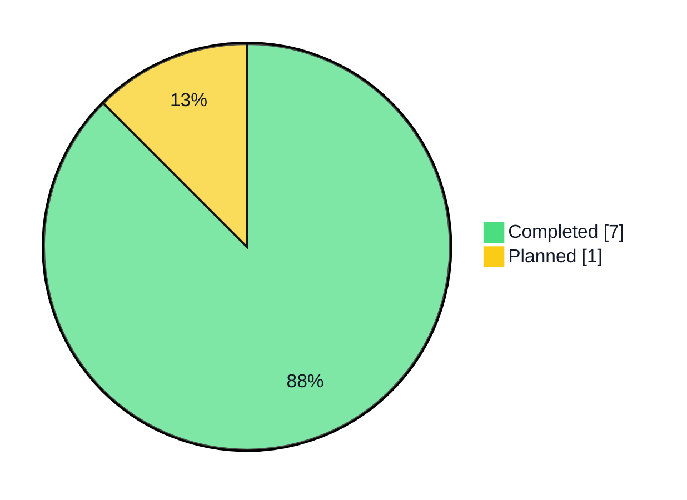
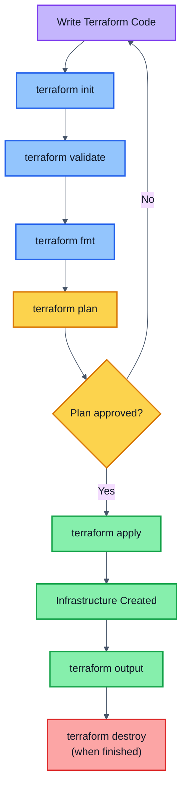
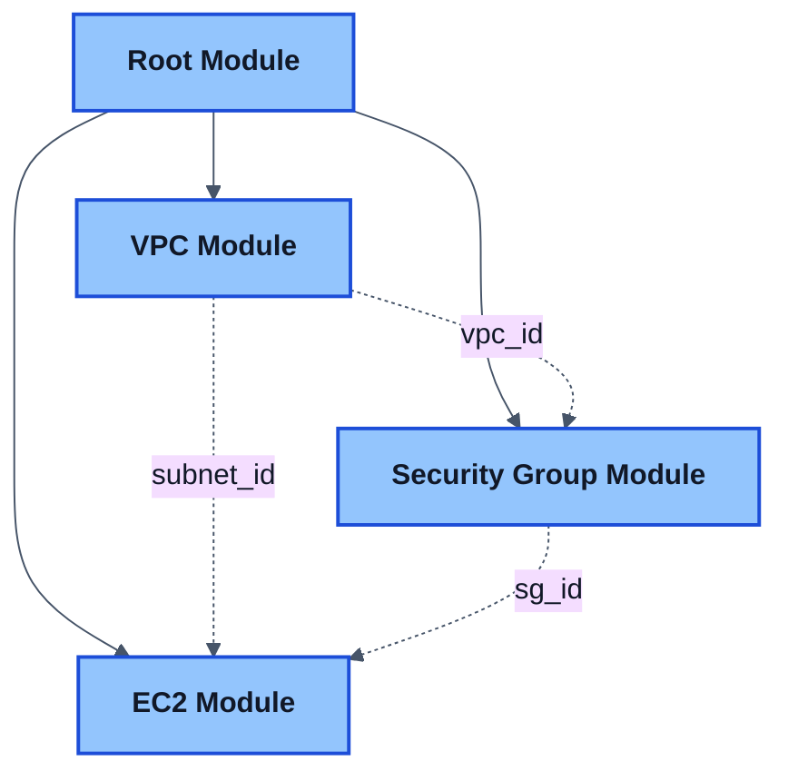

<div align="center">

# ☁️ Terraform Learning Journey

**Infrastructure as Code (IaC) on AWS — from a single EC2 instance to production-grade environments**

Part of the **Key Learning of Cloud and DevOps** repository

[](https://www.terraform.io/)
[](https://aws.amazon.com/)
[]()
[]()

</div>

---

## 📖 About This Journey

This repository documents my hands-on path to learning **Infrastructure as Code** with Terraform on AWS — replacing manual, click-through console setups with version-controlled, repeatable, and scalable infrastructure defined entirely in code.

Each phase builds on the last: starting with a single EC2 instance, then adding networking, remote state, multi-server architecture, load balancing, CI/CD infrastructure, and now **reusable Terraform modules** — with production-grade, multi-environment deployments as the final destination.

> 🔄 **This is a living repository** — new phases are added as I progress. Check back for updates.

```mermaid
%%{init:{
"theme":"base",
"themeVariables":{
"primaryTextColor":"#111827",
"lineColor":"#475569",
"background":"transparent"
}}}%%

flowchart LR
    P1["Phase 1<br/>Basic EC2"] --> P2["Phase 2<br/>VPC & Networking"]
    P2 --> P3["Phase 3<br/>Remote State"]
    P3 --> P4["Phase 4<br/>Multi-EC2"]
    P4 --> P5["Phase 5<br/>LB & Auto Scaling"]
    P5 --> P6["Phase 6<br/>Jenkins Infra"]
    P6 --> P7["Phase 7<br/>Terraform Modules"]
    P7 --> P8["Phase 8<br/>Production Infra"]

    classDef done fill:#4ADE80,stroke:#15803D,color:#111827,stroke-width:2px,font-weight:bold;
    classDef next fill:#FACC15,stroke:#B45309,color:#111827,stroke-width:2px,stroke-dasharray: 4 4;
    class P1,P2,P3,P4,P5,P6,P7 done;
    class P8 next;
```



---

## 🎯 Learning Objectives

- Learn Infrastructure as Code (IaC) principles and practice
- Provision AWS infrastructure using Terraform
- Understand and manage Terraform state
- Build reusable, scalable infrastructure patterns
- Follow production-grade infrastructure practices
- Progress from single-resource deployments to complete, modular cloud environments

---

## 🛠️ Technologies Used

| Category | Technology |
|---|---|
| ☁️ Cloud Provider | AWS |
| 🧱 Infrastructure as Code | Terraform |
| 🔧 Version Control | Git |
| 📦 Repository | GitHub |
| 💻 Code Editor | VS Code |
| 🖥️ Operating System | macOS |
| ⌨️ Terminal | zsh |

---

## 🗺️ Terraform Learning Roadmap

| Phase | Topic | Status |
|---|---|:---:|
| 1 | Basic EC2 Deployment | ✅ Completed |
| 2 | VPC and Networking | ✅ Completed |
| 3 | Remote State Management | ✅ Completed |
| 4 | Multi-EC2 Infrastructure | ✅ Completed |
| 5 | Load Balancer and Auto Scaling | ✅ Completed |
| 6 | Jenkins Infrastructure | ✅ Completed |
| 7 | Terraform Modules | ✅ Completed |
| 8 | Production Infrastructure | 🔜 Planned |

**Progress: 7 of 8 phases complete**



---

## 📂 Repository Structure

```text
01-terraform/
│
├── README.md
│
├── phase-1-basic-ec2/
│   ├── Terraform Fundamentals
│   ├── EC2 Deployment
│   ├── Security Groups
│   └── Variables and Outputs
│
├── phase-2-vpc-networking/
│   ├── VPC
│   ├── Public Subnet
│   ├── Internet Gateway
│   ├── Route Tables
│   ├── Route Table Associations
│   ├── Security Groups
│   └── EC2 Deployment in Custom Network
│
├── phase-3-remote-state/
│   ├── S3 Backend
│   ├── S3 Versioning
│   ├── DynamoDB State Locking
│   ├── Backend Configuration
│   └── Remote State Migration
│
├── phase-4-multi-ec2/
│   ├── Multiple EC2 Instances
│   ├── Shared Security Groups
│   ├── Resource Dependencies
│   ├── Terraform Outputs
│   └── Multi-Server Architecture
│
├── phase-5-load-balancer-autoscaling/
│   ├── Application Load Balancer
│   ├── Target Groups
│   ├── Launch Templates
│   └── Auto Scaling Groups
│
├── phase-6-jenkins-infrastructure/
│   ├── Jenkins EC2 Instance
│   ├── Jenkins Security Group
│   └── Terraform Outputs
│
├── phase-7-terraform-modules/
│   ├── modules/
│   │   ├── vpc/
│   │   ├── security-group/
│   │   └── ec2/
│   ├── Root Module (main.tf)
│   └── Modular Jenkins Deployment
│
└── phase-8-production-infrastructure/   🔜 planned
```

---

## 🧠 Terraform Concepts Covered

<details open>
<summary><strong>✅ Completed</strong></summary>

<br>

**Core Terraform Concepts**
- Providers · Resources · Variables · Outputs
- Terraform State · Remote State · Backend Configuration
- State Migration · State Locking
- Resource Dependencies · Multi-Resource Deployments
- **Terraform Modules · Root & Child Modules · Module Composition** *(new, Phase 7)*

**AWS Networking Concepts**
- VPC · Subnets · Internet Gateway
- Route Tables · Route Table Associations · Security Groups

**AWS Services Used**
- EC2 · S3 · DynamoDB

**Infrastructure Concepts**
- Multi-EC2 Infrastructure · Shared Security Groups
- Server Role Separation · Multi-Server Architecture
- **Modular, DRY Infrastructure Design** *(new, Phase 7)*

**Terraform Commands**

```bash
terraform init
terraform validate
terraform fmt
terraform plan
terraform apply
terraform output
terraform destroy
terraform init -reconfigure
terraform init -migrate-state
```

**Load Balancing & Scaling (Phase 5)**
- Application Load Balancer (ALB) · Target Groups
- Launch Templates · Auto Scaling Groups
- Dynamic Scaling Policies · High Availability Design

**CI/CD Infrastructure (Phase 6)**
- Dedicated Jenkins Server Provisioning
- CI/CD-Specific Security Group Configuration
- Infrastructure/Configuration Separation

**Terraform Modules (Phase 7)**
- Converting monolithic configuration into reusable modules
- Root Module vs. Child Module design
- Passing variables into modules and returning values via outputs
- Module-to-module communication (dependency graph)
- Production-ready folder structure for modular projects

</details>

<details>
<summary><strong>🔜 Upcoming Concepts — Phase 8</strong></summary>

<br>

- Workspaces
- `count` · `for_each` · Dynamic Blocks
- Data Sources
- Multi-Environment Deployments (dev / staging / prod)
- Automated Jenkins Setup (Ansible)

</details>

---

## 🚀 Terraform Workflow



---

## 📈 Progress Log

### ✅ Phase 1 — Basic EC2 Deployment
Created and managed:
- EC2 Instance
- Security Group
- Variables and Outputs
- Terraform Lifecycle Commands

### ✅ Phase 2 — VPC and Networking
Created and managed:
- Custom VPC · Public Subnet
- Internet Gateway · Route Table · Route Table Association
- Security Group
- EC2 Instance inside Custom VPC

### ✅ Phase 3 — Remote State Management
Created and managed:
- S3 Backend Bucket + Versioning
- DynamoDB Lock Table
- Backend Configuration
- Remote State Migration & Locking

### ✅ Phase 4 — Multi-EC2 Infrastructure
Created and managed:
- Jenkins Server EC2
- Application Server EC2
- Shared Security Group
- Multiple Outputs
- Multi-Server Architecture & Role Separation

### ✅ Phase 5 — Load Balancer and Auto Scaling
Created and managed:
- Application Load Balancer (ALB)
- Target Groups for routing traffic across instances
- Launch Templates for standardized instance configuration
- Auto Scaling Groups for elastic, high-availability infrastructure

### ✅ Phase 6 — Jenkins Server Infrastructure
Created and managed:
- Dedicated Jenkins EC2 Instance
- Jenkins Security Group (SSH + Jenkins UI access)
- Terraform Outputs for IP, URL, and SSH command
- Infrastructure foundation prepared for future CI/CD setup (`02-jenkins`, `03-ansible`)

### ✅ Phase 7 — Terraform Modules
Refactored the Jenkins infrastructure from Phase 6 into a fully modular codebase:



- **VPC Module** — VPC, public subnet, Internet Gateway, route table & association
- **Security Group Module** — Jenkins security group (ports 22, 80, 8080)
- **EC2 Module** — Ubuntu Jenkins instance with User Data bootstrap script
- **Root Module** — wires the three child modules together via inputs/outputs, keeping `main.tf` minimal
- Diagnosed and fixed a Jenkins repo signing-key issue and a missing root-level output bug

📄 Full write-up: [`phase-7-terraform-modules/README.md`](./phase-7-terraform-modules/README.md)

---

## 🎓 Learning Goal

```mermaid
%%{init:{
"theme":"base",
"themeVariables":{
"primaryTextColor":"#111827",
"lineColor":"#475569",
"background":"transparent"
}}}%%

flowchart LR
    A["Single EC2<br/>Instance"] --> B["Custom<br/>Networking"]
    B --> C["Remote State<br/>Management"]
    C --> D["Multi-Server<br/>Infrastructure"]
    D --> E["Load Balancing<br/>& Scaling"]
    E --> F["CI/CD Infra<br/>(Jenkins)"]
    F --> G["Reusable<br/>Modules"]
    G --> H["Production-Grade<br/>Deployments"]

    classDef done fill:#4ADE80,stroke:#15803D,color:#111827,stroke-width:2px,font-weight:bold;
    classDef current fill:#FCD34D,stroke:#B45309,color:#111827,stroke-width:2px,font-weight:bold;
    classDef next fill:#FACC15,stroke:#B45309,color:#111827,stroke-width:2px,stroke-dasharray: 4 4;
    class A,B,C,D,E,F,G done;
    class H next;
```



**Currently here:** ✅ Modules complete → next stop is **Phase 8: Production Infrastructure**

---

## 📌 Key Learnings So Far

- Infrastructure can be fully defined using code.
- Terraform provides repeatable and predictable deployments.
- Networking resources can be provisioned without touching the AWS Console.
- Local state files are not suitable for team environments.
- S3 provides centralized, durable Terraform state storage.
- DynamoDB prevents concurrent infrastructure modifications.
- Remote state management is a production standard in Terraform environments.
- Infrastructure can be separated into dedicated server roles.
- Security Groups can be shared across multiple EC2 instances.
- Terraform can provision multiple resources in a single deployment.
- Outputs simplify access to infrastructure details after deployment.
- Load balancing and auto scaling are key to building highly available systems.
- Infrastructure provisioning and software configuration should be kept separate.
- Security Groups can be tailored precisely to a service's access needs, such as Jenkins' SSH and UI ports.
- **Terraform Modules turn infrastructure into reusable, composable building blocks** *(new, Phase 7)*.
- **Child module outputs must be explicitly re-exported at the root level to be visible via `terraform output`** *(new, Phase 7)*.
- **A well-designed Root Module stays thin — most of the logic lives inside child modules** *(new, Phase 7)*.

---

## 🔜 What's Next

### Phase 8 — Production Infrastructure
- Multi-environment setups (dev / staging / prod) built on top of the Phase 7 modules
- Production-grade folder structure and best practices
- Introducing Terraform Workspaces, `for_each`, and data sources

---

<div align="center">

## 👨‍💻 Author

**Anshu Sharma**
Cloud & DevOps Learning Journey

[](https://github.com/anshu-sharma-devops)

*⭐ This repo is updated as new phases are completed — feel free to follow along.*

</div>
