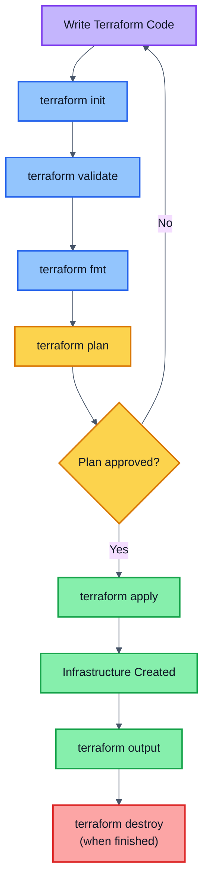
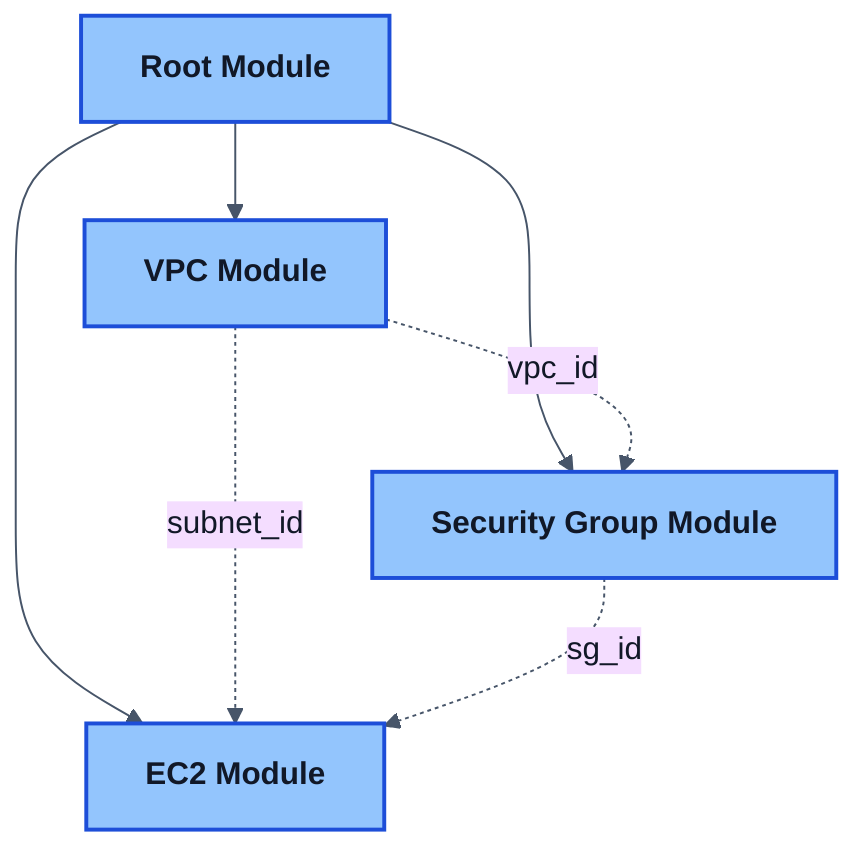
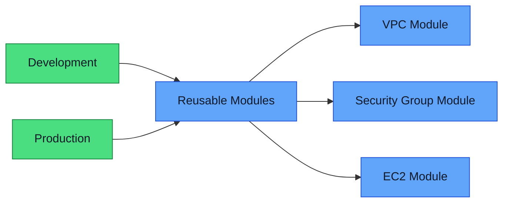
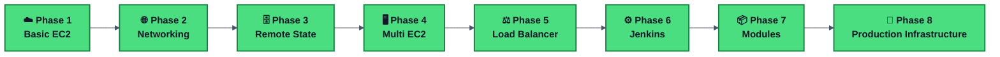

<div align="center">

# ☁️ Terraform Learning Journey

**Infrastructure as Code (IaC) on AWS — from a single EC2 instance to production-grade environments**

Part of the **Key Learning of Cloud and DevOps** repository

[](https://www.terraform.io/)
[](https://aws.amazon.com/)
[]()
[]()

</div>

---

## 📖 About This Journey
This repository documents my hands-on journey of learning **Infrastructure as Code (IaC)** using Terraform on AWS. The goal is to replace manual AWS console operations with version-controlled, repeatable, and scalable infrastructure defined entirely in code.

Each phase builds upon the previous one, starting with a single EC2 instance and gradually introducing networking, remote state management, multi-server infrastructure, load balancing, Jenkins infrastructure, reusable Terraform modules, and finally a production-style, environment-based infrastructure using Development and Production configurations.

The journey demonstrates how Terraform evolves from simple Infrastructure as Code examples into enterprise-ready cloud infrastructure that is modular, reusable, scalable, and maintainable.

> **This is a living repository** — new phases are added as I progress. Check back for updates.

```mermaid
%%{init:{
"theme":"base",
"themeVariables":{
"primaryTextColor":"#111827",
"lineColor":"#475569",
"background":"transparent"
}}}%%

flowchart LR
    P1["Phase 1<br/>Basic EC2"] --> P2["Phase 2<br/>VPC & Networking"]
    P2 --> P3["Phase 3<br/>Remote State"]
    P3 --> P4["Phase 4<br/>Multi-EC2"]
    P4 --> P5["Phase 5<br/>LB & Auto Scaling"]
    P5 --> P6["Phase 6<br/>Jenkins Infra"]
    P6 --> P7["Phase 7<br/>Terraform Modules"]
  P7 --> P8["Phase 8<br/>Production Infrastructure"]

classDef done fill:#4ADE80,stroke:#15803D,color:#111827,stroke-width:2px,font-weight:bold;

class P1,P2,P3,P4,P5,P6,P7,P8 done;
```



---

## 🎯 Learning Objectives

- Learn Infrastructure as Code (IaC) principles and practice
- Provision AWS infrastructure using Terraform
- Understand and manage Terraform state
- Build reusable, scalable infrastructure patterns
- Follow production-grade infrastructure practices
- Progress from single-resource deployments to complete, modular cloud environments

---

## 🛠️ Technologies Used

| Category | Technology |
|---|---|
| ☁️ Cloud Provider | AWS |
| 🧱 Infrastructure as Code | Terraform |
| 🔧 Version Control | Git |
| 📦 Repository | GitHub |
| 💻 Code Editor | VS Code |
| 🖥️ Operating System | macOS |
| ⌨️ Terminal | zsh |

---

## 🗺️ Terraform Learning Roadmap

| Phase | Topic | Status | Write-up |
|---|---|:---:|---|
| 1 | Basic EC2 Deployment | ✅ Completed | [README](./phase-1-basic-ec2/README.md) |
| 2 | VPC and Networking | ✅ Completed | [README](./phase-2-vpc-networking/README.md) |
| 3 | Remote State Management | ✅ Completed | [README](./phase-3-remote-state/README.md) |
| 4 | Multi-EC2 Infrastructure | ✅ Completed | [README](./phase-4-multi-ec2/README.md) |
| 5 | Load Balancer and Auto Scaling | ✅ Completed | [README](./phase-5-load-balancer-autoscaling/README.md) |
| 6 | Jenkins Infrastructure | ✅ Completed | [README](./phase-6-jenkins-infrastructure/README.md) |
| 7 | Terraform Modules | ✅ Completed | [README](./phase-7-terraform-modules/README.md) |
| 8 | Production Infrastructure | ✅ Completed | [README](./phase-8-production-infrastructure/README.md) |

**Progress: 8 of 8 phases complete**


## 📊 Progress

```text
████████████████████ 100%

8 / 8 Phases Completed
```

---

## 📂 Repository Structure

```text
01-terraform/
│
├── README.md
│
├── phase-1-basic-ec2/
│   ├── README.md
│   ├── Terraform Fundamentals
│   ├── EC2 Deployment
│   ├── Security Groups
│   └── Variables and Outputs
│
├── phase-2-vpc-networking/
│   ├── README.md
│   ├── VPC
│   ├── Public Subnet
│   ├── Internet Gateway
│   ├── Route Tables
│   ├── Route Table Associations
│   ├── Security Groups
│   └── EC2 Deployment in Custom Network
│
├── phase-3-remote-state/
│   ├── README.md
│   ├── S3 Backend
│   ├── S3 Versioning
│   ├── DynamoDB State Locking
│   ├── Backend Configuration
│   └── Remote State Migration
│
├── phase-4-multi-ec2/
│   ├── README.md
│   ├── Multiple EC2 Instances
│   ├── Shared Security Groups
│   ├── Resource Dependencies
│   ├── Terraform Outputs
│   └── Multi-Server Architecture
│
├── phase-5-load-balancer-autoscaling/
│   ├── README.md
│   ├── Application Load Balancer
│   ├── Target Groups
│   ├── Launch Templates
│   └── Auto Scaling Groups
│
├── phase-6-jenkins-infrastructure/
│   ├── README.md
│   ├── Jenkins EC2 Instance
│   ├── Jenkins Security Group
│   └── Terraform Outputs
│
├── phase-7-terraform-modules/
│   ├── README.md
│   ├── modules/
│   │   ├── vpc/
│   │   ├── security-group/
│   │   └── ec2/
│   ├── Root Module (main.tf)
│   └── Modular Jenkins Deployment
│
├── phase-8-production-infrastructure/
│   ├── README.md
│   ├── TROUBLESHOOTING.md
│   ├── environments/
│   │   ├── dev/
│   │   └── prod/
│   ├── modules/
│   │   ├── ec2/
│   │   ├── security-group/
│   │   └── vpc/
│   └── screenshots/
```

---

## 🧠 Terraform Concepts Covered

<details open>
<summary><strong>✅ Completed</strong></summary>

<br>

**Core Terraform Concepts**
- Providers · Resources · Variables · Outputs
- Terraform State · Remote State · Backend Configuration
- State Migration · State Locking
- Resource Dependencies · Multi-Resource Deployments
- Terraform Modules · Root & Child Modules · Module Composition

**AWS Networking Concepts**
- VPC · Subnets · Internet Gateway
- Route Tables · Route Table Associations · Security Groups

**AWS Services Used**
- EC2 · S3 · DynamoDB

**Infrastructure Concepts**
- Multi-EC2 Infrastructure · Shared Security Groups
- Server Role Separation · Multi-Server Architecture
- Modular, DRY Infrastructure Design
- Environment-Based Infrastructure
- Development and Production Separation
- Production Repository Organization
- Environment-specific `terraform.tfvars`

**Terraform Commands**

```bash
terraform init
terraform validate
terraform fmt
terraform plan
terraform apply
terraform output
terraform destroy
terraform init -reconfigure
terraform init -migrate-state
```

**Load Balancing & Scaling**
- Application Load Balancer (ALB)
- Target Groups
- Launch Templates
- Auto Scaling Groups
- Dynamic Scaling Policies
- High Availability Design

**CI/CD Infrastructure**
- Dedicated Jenkins Server Provisioning
- CI/CD-Specific Security Group Configuration
- Infrastructure and Configuration Separation

**Terraform Modules**
- Converting monolithic configuration into reusable modules
- Root Module vs Child Module design
- Passing variables into modules and returning values via outputs
- Module-to-module communication
- Production-ready modular folder structure

**Production Infrastructure**
- Separate `dev` and `prod` environments
- Reusable VPC, Security Group, and EC2 modules
- Environment-specific variables
- Production-style project structure
- Free Tier-safe deployment and cleanup

</details>

<details>
<summary><strong>🚀 Future Terraform Learning</strong></summary>

<br>

- Terraform Workspaces
- `count` and `for_each`
- Dynamic Blocks
- Data Sources
- Terraform Cloud
- Multi-AZ Architecture
- Private Subnets
- NAT Gateway
- Application Load Balancer
- Auto Scaling Groups

</details>

---

## 🚀 Terraform Workflow



---

## 📈 Progress Log

### ✅ Phase 1 — Basic EC2 Deployment
Created and managed:
- EC2 Instance
- Security Group
- Variables and Outputs
- Terraform Lifecycle Commands

📄 Full write-up: [`phase-1-basic-ec2/README.md`](./phase-1-basic-ec2/README.md)

### ✅ Phase 2 — VPC and Networking
Created and managed:
- Custom VPC · Public Subnet
- Internet Gateway · Route Table · Route Table Association
- Security Group
- EC2 Instance inside Custom VPC

📄 Full write-up: [`phase-2-vpc-networking/README.md`](./phase-2-vpc-networking/README.md)

### ✅ Phase 3 — Remote State Management
Created and managed:
- S3 Backend Bucket + Versioning
- DynamoDB Lock Table
- Backend Configuration
- Remote State Migration & Locking

📄 Full write-up: [`phase-3-remote-state/README.md`](./phase-3-remote-state/README.md)

### ✅ Phase 4 — Multi-EC2 Infrastructure
Created and managed:
- Jenkins Server EC2
- Application Server EC2
- Shared Security Group
- Multiple Outputs
- Multi-Server Architecture & Role Separation

📄 Full write-up: [`phase-4-multi-ec2/README.md`](./phase-4-multi-ec2/README.md)

### ✅ Phase 5 — Load Balancer and Auto Scaling
Created and managed:
- Application Load Balancer (ALB)
- Target Groups for routing traffic across instances
- Launch Templates for standardized instance configuration
- Auto Scaling Groups for elastic, high-availability infrastructure

📄 Full write-up: [`phase-5-load-balancer-autoscaling/README.md`](./phase-5-load-balancer-autoscaling/README.md)

### ✅ Phase 6 — Jenkins Server Infrastructure
Created and managed:
- Dedicated Jenkins EC2 Instance
- Jenkins Security Group (SSH + Jenkins UI access)
- Terraform Outputs for IP, URL, and SSH command
- Infrastructure foundation prepared for future CI/CD setup (`02-jenkins`, `03-ansible`)

📄 Full write-up: [`phase-6-jenkins-infrastructure/README.md`](./phase-6-jenkins-infrastructure/README.md)

### ✅ Phase 7 — Terraform Modules
Refactored the Jenkins infrastructure from Phase 6 into a fully modular codebase:




- **VPC Module** — VPC, public subnet, Internet Gateway, route table & association
- **Security Group Module** — Jenkins security group (ports 22, 80, 8080)
- **EC2 Module** — Ubuntu Jenkins instance with User Data bootstrap script
- **Root Module** — wires the three child modules together via inputs/outputs, keeping `main.tf` minimal
- Diagnosed and fixed a Jenkins repo signing-key issue and a missing root-level output bug

📄 Full write-up: [`phase-7-terraform-modules/README.md`](./phase-7-terraform-modules/README.md)

---
### ✅ Phase 8 — Production Infrastructure

Designed and deployed a production-style Terraform project using reusable modules and separate environments.



Created:

- Separate Development and Production environments
- Reusable VPC Module
- Reusable Security Group Module
- Reusable EC2 Module
- Automatic Apache installation using User Data
- Production-ready folder structure
- Modular Infrastructure as Code design
- Environment-specific configuration using terraform.tfvars

📖 Full write-up:
[`phase-8-production-infrastructure/README.md`](./phase-8-production-infrastructure/README.md)

---

## 🎓 Learning Goal



### 🏆 Journey Completed

```text
✅ Phase 1 – Basic EC2 Deployment
        ↓
✅ Phase 2 – VPC & Networking
        ↓
✅ Phase 3 – Remote State
        ↓
✅ Phase 4 – Multi-EC2 Infrastructure
        ↓
✅ Phase 5 – Load Balancer & Auto Scaling
        ↓
✅ Phase 6 – Jenkins Infrastructure
        ↓
✅ Phase 7 – Terraform Modules
        ↓
✅ Phase 8 – Production Infrastructure

🎉 Terraform Learning Journey Completed
```
<details>
<summary><strong>🚀 Future Terraform Learning</strong></summary>

<br>

- Terraform Workspaces
- count and for_each
- Dynamic Blocks
- Data Sources
- Terraform Cloud
- Multi-AZ Architecture
- Private Subnets
- NAT Gateway
- ALB + ASG Production Deployment
</details>

---

## 📌 Project Highlights

- ✅ 8 Hands-on Terraform Projects
- ✅ AWS Free Tier Compatible
- ✅ Production-style Repository Structure
- ✅ Modular Infrastructure Design
- ✅ 100+ Screenshots
- ✅ Enterprise Documentation


  
## 📌 Key Learnings So Far

- Infrastructure can be fully defined using code.
- Terraform provides repeatable and predictable deployments.
- Networking resources can be provisioned without touching the AWS Console.
- Local state files are not suitable for team environments.
- S3 provides centralized, durable Terraform state storage.
- DynamoDB prevents concurrent infrastructure modifications.
- Remote state management is a production standard in Terraform environments.
- Infrastructure can be separated into dedicated server roles.
- Security Groups can be shared across multiple EC2 instances.
- Terraform can provision multiple resources in a single deployment.
- Outputs simplify access to infrastructure details after deployment.
- Load balancing and auto scaling are key to building highly available systems.
- Infrastructure provisioning and software configuration should be kept separate.
- Security Groups can be tailored precisely to a service's access needs, such as Jenkins' SSH and UI ports.
- **Terraform Modules turn infrastructure into reusable, composable building blocks** *(new, Phase 7)*.
- **Child module outputs must be explicitly re-exported at the root level to be visible via `terraform output`** *(new, Phase 7)*.
- **A well-designed Root Module stays thin — most of the logic lives inside child modules** *(new, Phase 7)*.
- Production infrastructure should be organized using separate environments.
- Terraform modules make Infrastructure as Code reusable and maintainable.
- Development and Production can share the same modules while using different configurations.
- A production-grade Terraform repository is easier to scale, maintain, and collaborate on.

---

<div align="center">

## 🎉 Terraform Learning Journey Completed

From a single EC2 instance to a production-style Terraform project using reusable modules and environment-based architecture.

⭐ The next step is integrating Terraform with Jenkins, Ansible, Docker, Kubernetes, Helm, Prometheus, and Grafana to build complete DevOps solutions.

</div>
📊 Repository Statistics

| Metric | Value |
|--------|------:|
| Terraform Phases | 8 |
| AWS Services Used | 8+ |
| Terraform Modules | 3 |
| Environments | 2 |
| Screenshots | 100+ |
| Documentation | Complete |

## 🏆 Achievements

- Completed 8 Terraform phases
- Built reusable infrastructure modules
- Designed environment-based infrastructure
- Followed Infrastructure as Code best practices
- Created production-quality documentation

---
## 🚀 What's Next

With the Terraform learning journey complete, the next step is to integrate Terraform into complete DevOps workflows.

Future projects will combine Terraform with:

- Jenkins (Infrastructure CI/CD)
- Ansible (Configuration Management)
- Docker (Containerization)
- Kubernetes (Container Orchestration)
- Helm (Package Management)
- Prometheus & Grafana (Monitoring & Observability)

<div align="center">

## 👨‍💻 Author

**Anshu Sharma**

Cloud & DevOps Learning Journey

[](https://github.com/anshu-sharma-devops)

*⭐ This repository is updated as new phases are completed.*

</div>