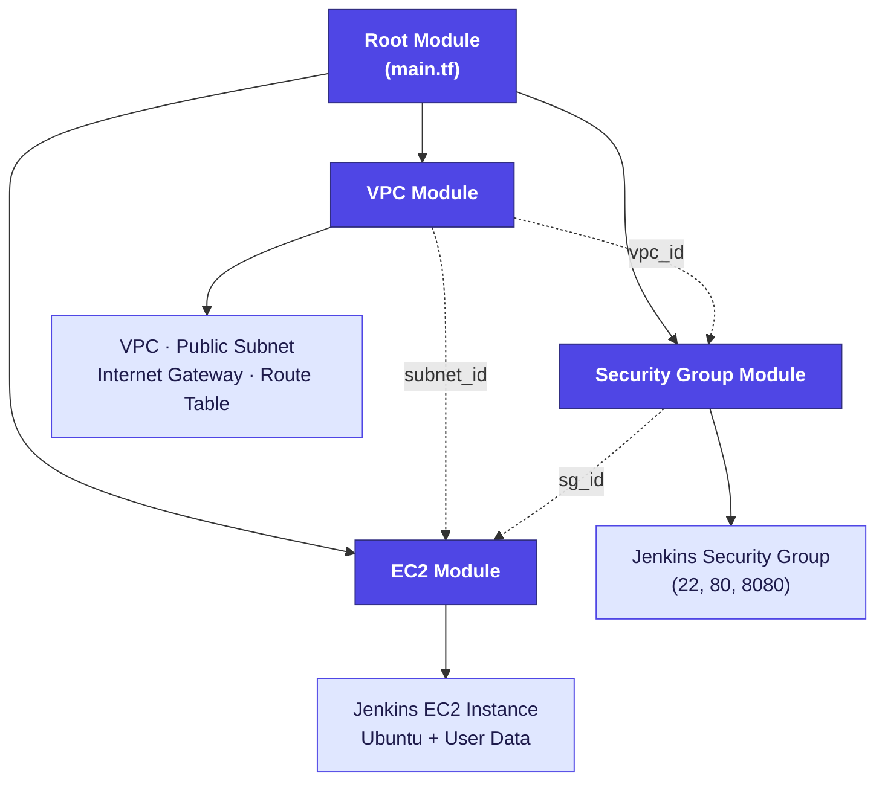
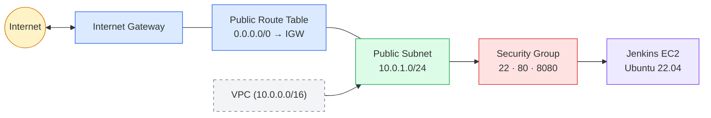
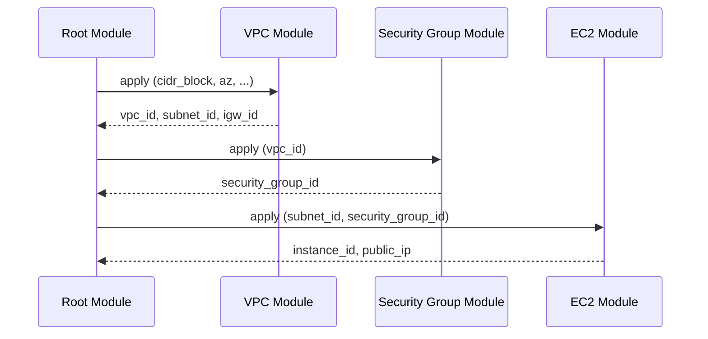
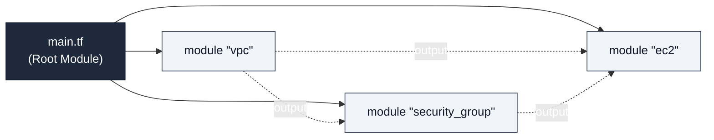
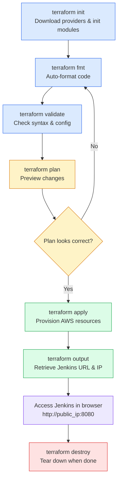
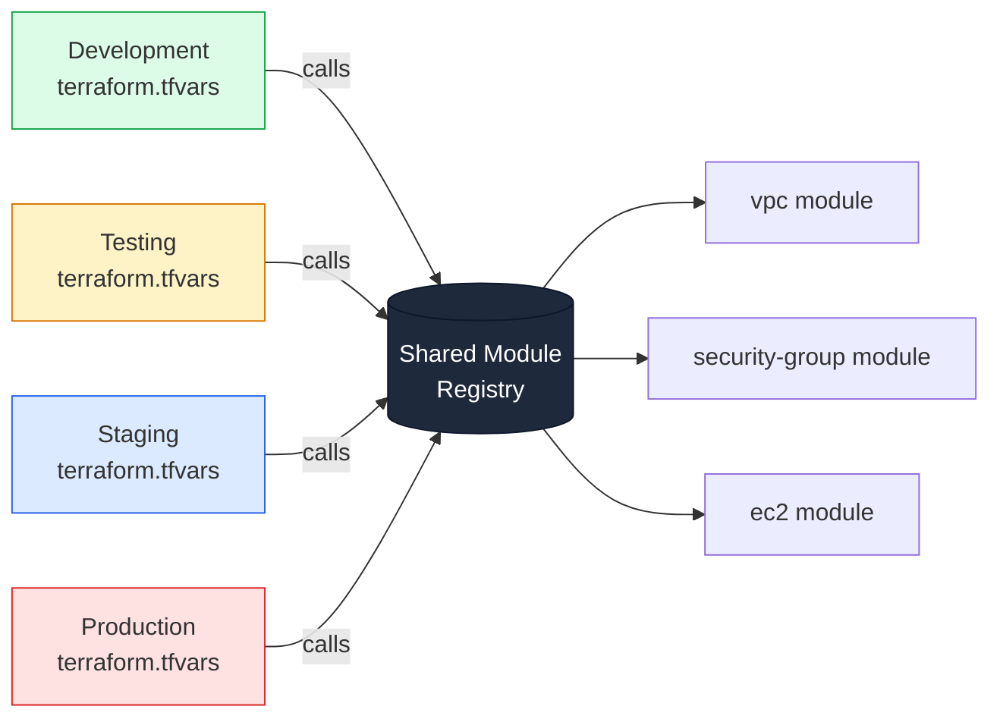

# Phase 7 — Terraform Modules

## Project Overview

In this phase, the infrastructure built in earlier Terraform projects was reorganized into **Terraform Modules**. Instead of defining every AWS resource inside a single `main.tf` file, the infrastructure is now split into independent, reusable modules — each responsible for one concern: networking, security, or compute.

This project demonstrates how professional DevOps teams structure Terraform code so that it stays maintainable, testable, and reusable as infrastructure grows across multiple environments and teams.

**Why this matters:** a single flat `main.tf` works for a demo, but it quickly becomes unmanageable in real projects — hundreds of resources, no separation of concerns, and no way to reuse networking or security logic without copy-pasting code. Modules solve this by turning infrastructure into versioned, composable building blocks, similar to functions in software engineering.

---

## Table of Contents

1. [Objectives](#objectives)
2. [Architecture](#architecture)
3. [Project Structure](#project-structure)
4. [AWS Resources Provisioned](#aws-resources-provisioned)
5. [Modules](#modules)
6. [Module Communication](#module-communication)
7. [Root Module](#root-module)
8. [Input Variables](#input-variables)
9. [Outputs](#outputs)
10. [Terraform Commands Used](#terraform-commands-used)
11. [Deployment Walkthrough](#deployment-walkthrough)
12. [Screenshots](#screenshots)
13. [Key Learnings](#key-learnings)
14. [Real-World Use Case](#real-world-use-case)
15. [Challenges Faced](#challenges-faced)
16. [Cleanup](#cleanup)
17. [Conclusion](#conclusion)

---

## Objectives

- Understand the concept of Terraform Modules
- Convert a monolithic Terraform configuration into reusable modules
- Understand the relationship between Root Modules and Child Modules
- Pass variables between modules
- Export resource information using outputs
- Build a clean, production-ready Terraform project structure
- Deploy a Jenkins server using modular infrastructure

---

## Architecture



The dotted arrows show the real dependency chain: the **VPC module** must run first because both the Security Group and EC2 modules need its outputs (`vpc_id`, `subnet_id`). The **Security Group module** runs next, and its `sg_id` output feeds into the **EC2 module** last. Terraform resolves this ordering automatically from the module graph — no manual sequencing is required.

---

## Project Structure

```
phase-7-terraform-modules/
├── provider.tf
├── variables.tf
├── outputs.tf
├── terraform.tfvars
├── main.tf
├── README.md
├── TROUBLESHOOTING.md
├── screenshots/
└── modules/
    ├── vpc/
    │   ├── main.tf
    │   ├── variables.tf
    │   └── outputs.tf
    ├── security-group/
    │   ├── main.tf
    │   ├── variables.tf
    │   └── outputs.tf
    └── ec2/
        ├── main.tf
        ├── variables.tf
        └── outputs.tf
```

---

## AWS Resources Provisioned

- Amazon VPC
- Public Subnet
- Internet Gateway
- Public Route Table + Association
- Security Group
- Jenkins EC2 Instance
- User Data Script

### Network Topology



Traffic flows from the internet through the Internet Gateway, into the public subnet via the route table, and finally through the security group's allow-list before reaching the Jenkins instance.

---

## Modules

### 1. VPC Module

Creates the core networking infrastructure that every other module depends on.

| | |
|---|---|
| **Path** | `modules/vpc/` |
| **Resources** | VPC, Public Subnet, Internet Gateway, Route Table, Route Table Association |
| **Inputs** | VPC CIDR, Subnet CIDR, Availability Zone, Resource Names |
| **Outputs** | VPC ID, Public Subnet ID, Internet Gateway ID, Route Table ID |

**What it does, step by step:**

1. Creates a VPC with a configurable CIDR block (e.g. `10.0.0.0/16`).
2. Creates a public subnet inside that VPC, tied to a specific Availability Zone.
3. Attaches an Internet Gateway to the VPC so resources can reach the public internet.
4. Creates a route table with a default route (`0.0.0.0/0`) pointing at the Internet Gateway.
5. Associates that route table with the public subnet, making it "public."

This module has zero dependencies on the other two — it can be deployed and tested completely on its own.

### 2. Security Group Module

Creates the security group used by the Jenkins server. It depends on the VPC module's `vpc_id` output — a security group must always live inside a VPC.

| | |
|---|---|
| **Path** | `modules/security-group/` |
| **Depends on** | `vpc_id` (from the VPC module) |
| **Output** | Security Group ID |

**Inbound Rules**

| Port | Protocol | Purpose |
|------|----------|---------|
| 22 | TCP | SSH access for administration |
| 80 | TCP | HTTP access |
| 8080 | TCP | Jenkins web interface |

**Outbound Rules:** Allow all traffic (`0.0.0.0/0`), so the instance can reach package repositories and APIs during setup.

> ⚠️ **Security note:** for production use, port 22 should be restricted to a known IP range rather than left open to `0.0.0.0/0`.

### 3. EC2 Module

Provisions the Jenkins server itself. It depends on outputs from both the VPC module (subnet) and the Security Group module (security group ID).

| | |
|---|---|
| **Path** | `modules/ec2/` |
| **Depends on** | `subnet_id` (VPC module), `security_group_id` (Security Group module) |
| **Resources** | Ubuntu EC2 Instance, Key Pair reference, User Data script, Public IP |
| **Outputs** | Instance ID, Public IP |

**User Data script responsibilities:**

- Update package lists (`apt-get update`)
- Install Java (a prerequisite for Jenkins)
- Add the Jenkins repository and signing key
- Install and start the Jenkins service
- Enable Jenkins to launch automatically on reboot

---

## Module Communication

Modules never hardcode each other's values. Instead, a **child module** exposes data through its `outputs.tf`, and the **root module** passes that data into the next module as an input variable.



Example reference inside the root module:

```hcl
module "security_group" {
  source = "./modules/security-group"
  vpc_id = module.vpc.vpc_id
}

module "ec2" {
  source            = "./modules/ec2"
  subnet_id         = module.vpc.public_subnet_id
  security_group_id = module.security_group.security_group_id
}
```

The Security Group module receives the VPC ID directly from the VPC module's output — no ID is ever typed in manually.

---

## Root Module

The Root Module (`main.tf` at the project root) coordinates deployment by calling each child module and wiring their outputs together:



Because each module owns its own resources, the Root Module itself stays minimal — it's mostly `module` blocks and variable wiring, with no raw AWS resources defined directly.

---

## Input Variables

Input variables make the infrastructure reusable across environments. Examples:

- AWS Region
- VPC CIDR
- Public Subnet CIDR
- Availability Zone
- AMI ID
- Instance Type
- Key Pair Name
- Security Group Name

All values are stored in `terraform.tfvars`.

---

## Outputs

After deployment, Terraform surfaces key resource details:

- VPC ID
- Public Subnet ID
- Internet Gateway ID
- Route Table ID
- Security Group ID
- Jenkins Instance ID
- Jenkins Public IP
- Jenkins URL

```
jenkins_public_ip = "43.xxx.xxx.xxx"
jenkins_url       = "http://43.xxx.xxx.xxx:8080"
```

---

## Terraform Commands Used

```bash
terraform init        # Initialize Terraform
terraform fmt         # Format configuration
terraform validate    # Validate configuration
terraform plan        # Review execution plan
terraform apply       # Deploy infrastructure
terraform output      # View outputs
terraform destroy     # Destroy infrastructure
```

---

## Deployment Walkthrough



Typical timeline: `init` and `fmt`/`validate` take a few seconds; `plan` runs almost instantly since it only reads AWS state; `apply` takes roughly 1–3 minutes, most of which is EC2 boot time and the Jenkins install script running via User Data.

---

## Screenshots

- Project folder structure
- `terraform init`
- `terraform plan`
- `terraform apply`
- VPC created
- Public subnet created
- Internet Gateway attached
- Route table association
- Security group created
- EC2 instance running
- Terraform outputs
- SSH connection
- Jenkins web interface
- `terraform destroy`

---

## Key Learnings

- What Terraform Modules are, and how they differ from a monolithic config
- The difference between Root Modules and Child Modules
- How to write reusable Terraform code
- Passing variables into modules and returning values via outputs
- How modules communicate with one another
- Organizing Terraform projects for long-term scalability
- Separating networking, security, and compute into independent modules

---

## Real-World Use Case

In production, infrastructure is rarely managed in a single Terraform file. Organizations instead build a shared module registry — often in its own Git repository — that multiple environments and teams consume:



Only the variable values (instance size, CIDR ranges, environment tags, etc.) change between environments — the underlying module code stays identical, tested, and version-controlled. This is what makes a module registry so valuable: a bug fix or improvement made once benefits every environment that consumes it.

---

## Challenges Faced

| Issue | Root Cause | Resolution |
|---|---|---|
| Jenkins package installation failed during EC2 User Data execution | The Jenkins project rotated its repository signing key, so the previously trusted key was rejected by `apt` | Updated the User Data script to fetch and trust the current signing key before installing Jenkins |
| `terraform output` showed nothing after apply | Outputs were defined only inside `modules/*/outputs.tf`; Terraform does not surface child-module outputs automatically | Added matching `output` blocks in the root `outputs.tf` that reference `module.<name>.<output>` |

See `TROUBLESHOOTING.md` for the full diagnostic steps taken for each issue.

---

## Cleanup

```bash
terraform destroy
```

This removes all AWS resources created during the project to avoid unnecessary charges.

---

## Conclusion

Phase 7 introduced one of the most important concepts in professional Terraform workflows: **modules**. By splitting the infrastructure into dedicated networking, security, and compute components, the project became more organized, reusable, and easier to maintain than a single monolithic configuration.

This phase lays the foundation for production-grade infrastructure, where the same modules can be reused across Development, Testing, Staging, and Production — and sets up the next phase, where these modules will be combined into a complete production deployment.