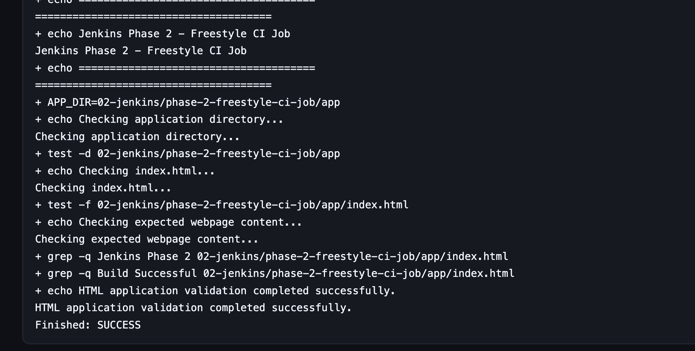
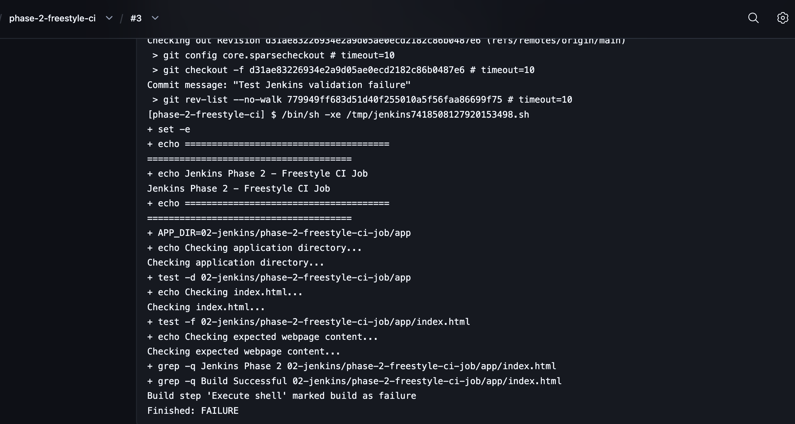
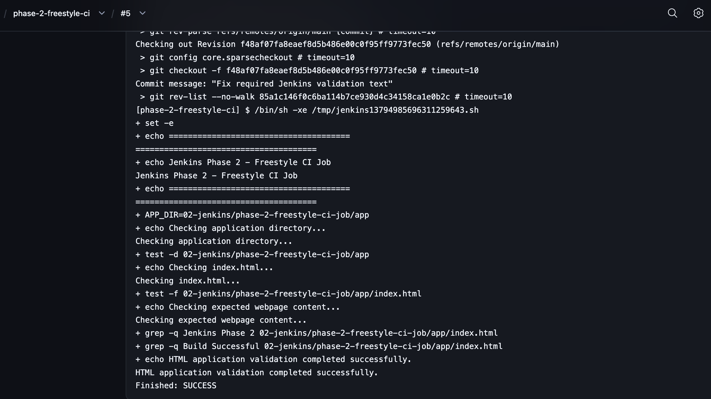
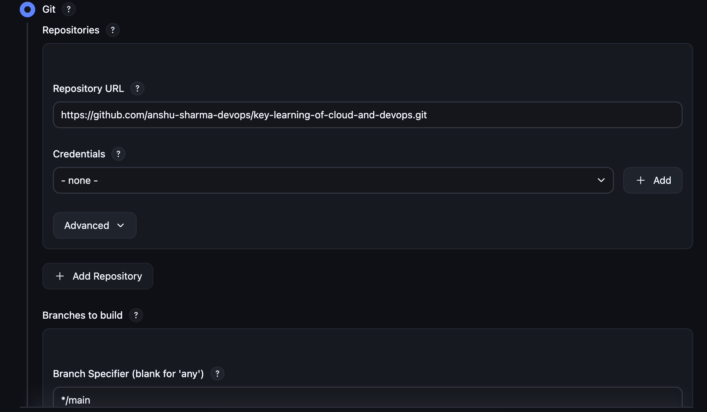
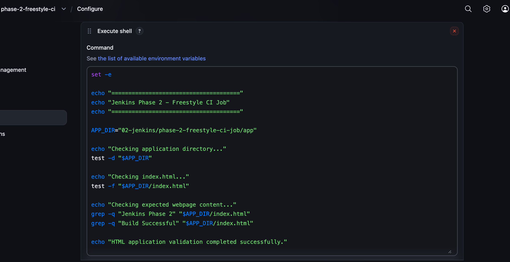
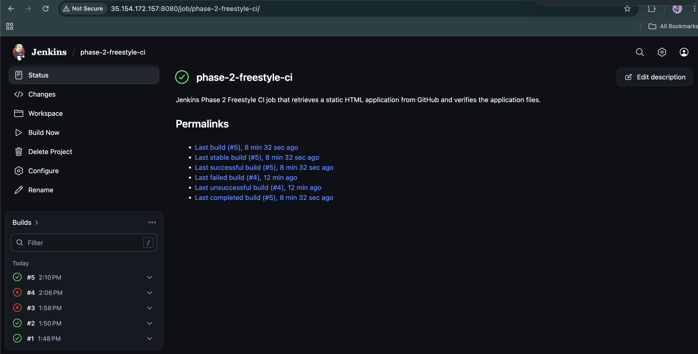
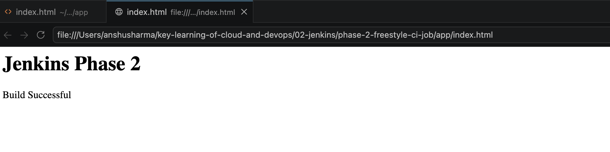

<div align="center">

# ⚙️ Jenkins Phase 2 — Freestyle CI Job with GitHub

**Creating a basic Continuous Integration workflow using Jenkins, GitHub, and shell-based validation**

Part of the [Jenkins Learning Journey](../README.md)


</div>

---

## 📌 Project Overview

This phase demonstrates how to create a Jenkins Freestyle project and connect it to a public GitHub repository.

Jenkins retrieves the latest code from the `main` branch and runs a shell-based validation script against a static HTML application.

The validation confirms that:

- The application directory exists.
- The `index.html` file exists.
- The page contains the expected project heading.
- The page contains the required build status message.

An intentional code change was also introduced to confirm that Jenkins correctly detects invalid application content and marks the build as failed.

---

## 🎯 Objectives

The objectives of this phase were to:

- Create a Jenkins Freestyle job.
- Connect Jenkins with a GitHub repository.
- Retrieve code from the `main` branch.
- Understand the Jenkins workspace.
- Execute shell commands through Jenkins.
- Validate application files and content.
- Observe successful and failed builds.
- Fix the application and recover the CI build.
- Understand the basic Continuous Integration workflow.

---

## 🛠️ Technologies Used

| Technology | Purpose |
|---|---|
| Jenkins | CI server and Freestyle job execution |
| GitHub | Remote source-code repository |
| Git | Source-code retrieval and revision tracking |
| HTML5 | Static application used for validation |
| Shell | Application file and content validation |
| AWS EC2 | Host machine for the reusable Jenkins server |
| Terraform | Previously used to provision the Jenkins infrastructure |

---

## 🏗️ CI Workflow

```text
Developer updates code
        ↓
Code is pushed to GitHub
        ↓
Jenkins retrieves the main branch
        ↓
Jenkins creates or updates its workspace
        ↓
Shell validation script executes
        ↓
Directory, file and content are checked
        ↓
Build is marked SUCCESS or FAILURE
```

---

## 📁 Project Structure

```text
phase-2-freestyle-ci-job/
├── app/
│   └── index.html
├── screenshots/
│   ├── 01-git-configuration.png
│   ├── 02-build-script-configuration.png
│   ├── 03-build-history.png
│   ├── 04-first-build-success-console.png
│   ├── 05-intentional-failure-console.png
│   ├── 06-recovered-build-success-console.png
│   └── 07-final-website-preview.png
├── README.md
└── TROUBLESHOOTING.md
```

---

## ☁️ Jenkins Infrastructure

The Jenkins controller used in this phase was provisioned previously with Terraform and hosted on an Ubuntu 24.04 AWS EC2 instance.

The same Jenkins controller will be reused in future phases so that jobs, plugins, settings, credentials, and build history remain available throughout the learning journey.

The EC2 instance is stopped after practice instead of being destroyed.

> The public IPv4 address can change whenever the EC2 instance is stopped and restarted.

---

## ⚙️ Jenkins Job Configuration

The following Jenkins Freestyle project was created:

```text
phase-2-freestyle-ci
```

### Description

```text
Jenkins Phase 2 Freestyle CI job that retrieves a static HTML application from GitHub and verifies the application files.
```

### Source Code Management

| Setting | Value |
|---|---|
| Source Code Management | Git |
| Repository | `https://github.com/anshu-sharma-devops/key-learning-of-cloud-and-devops.git` |
| Credentials | None — public repository |
| Branch Specifier | `*/main` |

### Build Retention

The job was configured to discard old builds:

```text
Days to keep builds: 7
Maximum builds to keep: 10
```

---

## 🧪 Validation Script

The following script was configured under:

```text
Build Steps → Execute shell
```

```bash
set -e

echo "======================================"
echo "Jenkins Phase 2 - Freestyle CI Job"
echo "======================================"

APP_DIR="02-jenkins/phase-2-freestyle-ci-job/app"

echo "Checking application directory..."
test -d "$APP_DIR"

echo "Checking index.html..."
test -f "$APP_DIR/index.html"

echo "Checking expected webpage content..."
grep -q "Jenkins Phase 2" "$APP_DIR/index.html"
grep -q "Build Successful" "$APP_DIR/index.html"

echo "HTML application validation completed successfully."
```

---

## 🔍 Script Explanation

### Stop after an error

```bash
set -e
```

This causes the shell script to stop immediately when a command fails. Jenkins then marks the build as failed.

### Define the application directory

```bash
APP_DIR="02-jenkins/phase-2-freestyle-ci-job/app"
```

This stores the application location in a reusable variable.

### Check the application directory

```bash
test -d "$APP_DIR"
```

The `-d` option verifies that the directory exists.

### Check the HTML file

```bash
test -f "$APP_DIR/index.html"
```

The `-f` option verifies that `index.html` exists.

### Check required content

```bash
grep -q "Jenkins Phase 2" "$APP_DIR/index.html"
grep -q "Build Successful" "$APP_DIR/index.html"
```

The `grep -q` commands search silently for required text. A missing phrase returns a failure status.

---

## ✅ First Successful Build

During the first build, Jenkins:

1. Started the build manually.
2. Created a workspace.
3. Cloned the GitHub repository.
4. Checked out the `main` branch.
5. Confirmed the application directory existed.
6. Confirmed `index.html` existed.
7. Found both required text values.
8. Marked the build as successful.

Successful console output:

```text
Checking application directory...
Checking index.html...
Checking expected webpage content...
HTML application validation completed successfully.
Finished: SUCCESS
```



---

## ❌ Intentional Failure Test

To test the validation, the application status was changed from:

```html
<div class="status">Build Successful</div>
```

to:

```html
<div class="status">Deployment Successful</div>
```

Jenkins still expected:

```text
Build Successful
```

Therefore, this command returned a failure:

```bash
grep -q "Build Successful" "$APP_DIR/index.html"
```

Because `set -e` was enabled, the script stopped and Jenkins marked the build as failed.

Failure output:

```text
Build step 'Execute shell' marked build as failure
Finished: FAILURE
```



---

## 🔧 Build Recovery

The required HTML text was restored:

```html
<div class="status">Build Successful</div>
```

The corrected application was committed and pushed to GitHub. Jenkins retrieved the new commit and executed the validation again.

Both content checks passed:

```text
grep -q Jenkins Phase 2
grep -q Build Successful
```

Final result:

```text
HTML application validation completed successfully.
Finished: SUCCESS
```



---

## 📊 Build Results

| Test | Application condition | Result |
|---|---|---|
| Initial build | Both required values present | ✅ SUCCESS |
| Intentional failure | `Build Successful` removed | ❌ FAILURE |
| Incomplete recovery | Required heading was missing or mismatched | ❌ FAILURE |
| Final recovery | Both required values restored | ✅ SUCCESS |

---

## 📸 Screenshots

### Git Configuration



### Build Script Configuration



### Build History



### Final Website



---

## 🧠 What I Learned

In this phase, I learned:

- How to create and configure a Jenkins Freestyle project.
- How Jenkins connects to and clones a GitHub repository.
- How Jenkins stores project code inside a workspace.
- How to execute shell commands from a Jenkins build.
- How `test -d` validates a directory.
- How `test -f` validates a file.
- How `grep -q` checks required application content.
- How `set -e` stops a script after an error.
- How Jenkins marks builds as successful or failed.
- How CI detects an invalid code change.
- How fixing and pushing code can recover a failed build.
- Why build history and console output are important for troubleshooting.

---

## 🛠️ Troubleshooting

The errors and fixes encountered in this phase are documented separately:

➡️ [View TROUBLESHOOTING.md](TROUBLESHOOTING.md)

Issues included:

- Project folders were initially created outside the repository.
- VS Code opened `index.html` as a rendered preview.
- Jenkins was missing from the reusable EC2 instance.
- The intentional content change caused the expected build failure.
- The first recovery attempt still had mismatched validation text.

---

## 💰 Cost and Cleanup

This phase reused the existing Jenkins EC2 instance.

To avoid unnecessary AWS charges:

- The instance is stopped after completing the practice session.
- The instance is not destroyed because it contains Jenkins jobs, plugins, configuration, and build history.
- The new public IPv4 address is checked after every restart.

> Stopping an EC2 instance stops compute charges, but attached EBS storage may still generate a small charge depending on Free Tier eligibility and account usage.

---

## 🚀 Next Phase

The next phase will move from a manually configured Freestyle project to a Pipeline-as-Code workflow.

### Phase 3 — Declarative Pipeline with Jenkinsfile

Planned topics:

- Creating a `Jenkinsfile`.
- Understanding stages and steps.
- Running checkout, validation and build stages.
- Storing the pipeline configuration in GitHub.
- Viewing pipeline stage results in Jenkins.

---

## ✅ Conclusion

Jenkins Phase 2 successfully demonstrated a basic Continuous Integration workflow using a Freestyle job.

Jenkins retrieved the latest application code from GitHub, validated the project structure and required HTML content, detected an intentional invalid change, and returned to a successful state after the code was corrected.

This phase established the foundation required for learning Jenkins Pipeline as Code in the next phase.

---

<div align="center">

**Created by Anshu Sharma**

*Cloud and DevOps Learning Journey*

</div>