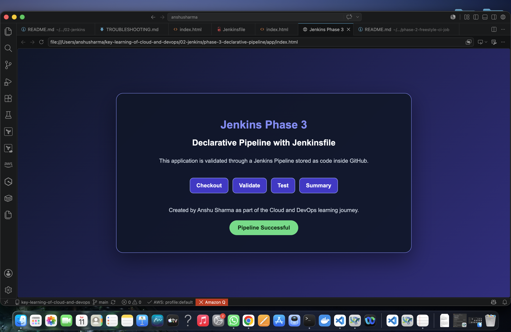
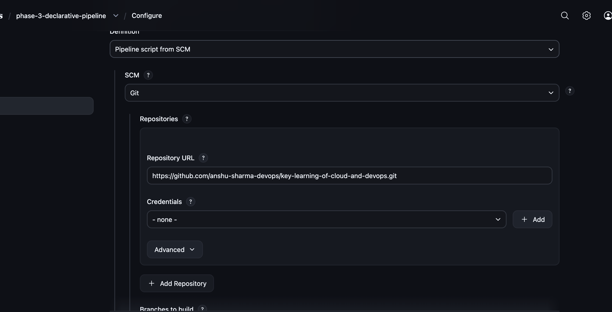
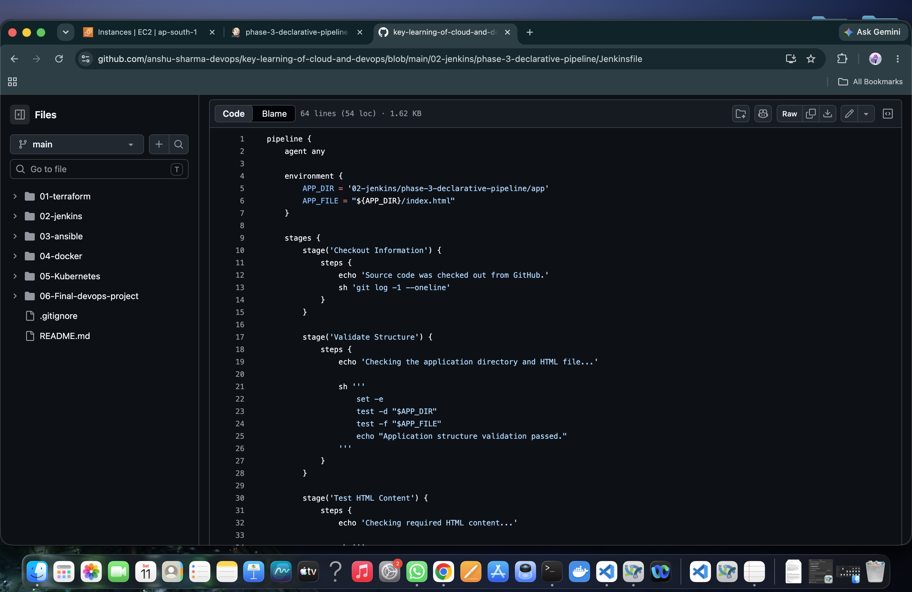
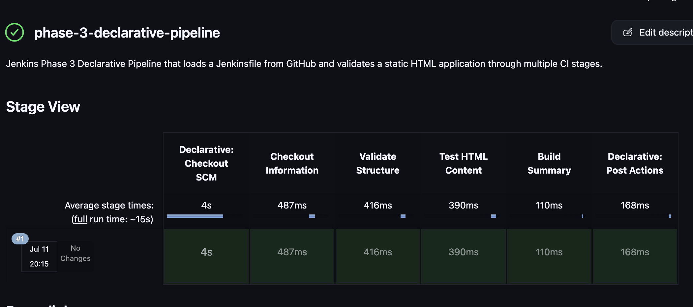
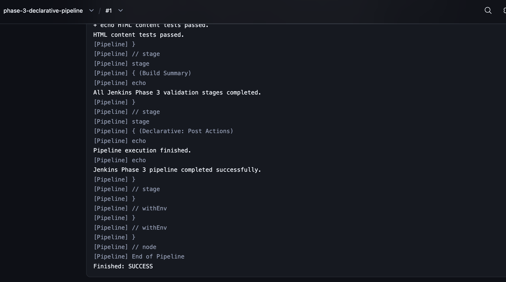

<div align="center">

# ⚙️ Jenkins Phase 3 — Declarative Pipeline with Jenkinsfile

**Implementing Pipeline as Code using Jenkins, GitHub and a multi-stage Declarative Pipeline**

Part of the [Jenkins Learning Journey](../README.md)


</div>

---

## 📌 Project Overview

This phase demonstrates how to move from a manually configured Jenkins Freestyle job to a Declarative Pipeline stored as code inside a GitHub repository.

A `Jenkinsfile` defines the complete CI workflow using multiple stages. Jenkins retrieves this file from GitHub, checks out the repository and executes each stage in sequence.

The pipeline validates a static HTML application by checking:

- The latest Git commit.
- The application directory.
- The `index.html` file.
- Required HTML content.
- The final pipeline result.

This approach makes the CI workflow version-controlled, reusable and easier to review.

---

## 🎯 Objectives

The objectives of this phase were to:

- Understand the difference between Freestyle jobs and Pipeline jobs.
- Create a Jenkins Declarative Pipeline.
- Store the pipeline definition in a `Jenkinsfile`.
- Load the `Jenkinsfile` directly from GitHub.
- Understand Pipeline as Code.
- Organize CI tasks into clear stages.
- Define reusable environment variables.
- Execute shell commands inside pipeline stages.
- Use post-build actions.
- Review stage results and console output.

---

## 🛠️ Technologies Used

| Technology | Purpose |
|---|---|
| Jenkins | Declarative Pipeline execution |
| Jenkinsfile | Version-controlled pipeline definition |
| GitHub | Remote source-code and pipeline repository |
| Git | Source-code checkout and commit inspection |
| Groovy | Declarative Pipeline syntax |
| Shell | File and content validation |
| HTML5 | Static application used for testing |
| AWS EC2 | Host for the reusable Jenkins controller |
| Terraform | Previously used to provision the Jenkins infrastructure |

---

## 🔄 Phase 2 vs Phase 3

| Phase 2 — Freestyle Job | Phase 3 — Declarative Pipeline |
|---|---|
| Build steps configured through Jenkins UI | Build stages defined in a `Jenkinsfile` |
| Configuration mainly stored on Jenkins | Pipeline configuration stored in GitHub |
| Basic sequential shell execution | Structured stages and post actions |
| Harder to review through Git | Version-controlled and reviewable |
| Less portable | Reusable across Jenkins environments |
| Basic CI introduction | Pipeline as Code foundation |

---

## 🏗️ Pipeline Workflow

```text
Developer creates application and Jenkinsfile
                    ↓
Code is committed and pushed to GitHub
                    ↓
Jenkins retrieves the Jenkinsfile from GitHub
                    ↓
Declarative: Checkout SCM
                    ↓
Checkout Information
                    ↓
Validate Structure
                    ↓
Test HTML Content
                    ↓
Build Summary
                    ↓
Post Actions
                    ↓
Pipeline marked SUCCESS or FAILURE
```

---

## 📁 Project Structure

```text
phase-3-declarative-pipeline/
├── app/
│   └── index.html
├── screenshots/
│   ├── 01-pipeline-scm-configuration.png
│   ├── 02-successful-stage-view.png
│   ├── 03-success-console-output.png
│   ├── 04-jenkinsfile-on-github.png
│   └── 05-application-preview.png
├── Jenkinsfile
├── README.md
└── TROUBLESHOOTING.md
```

---

## ☁️ Jenkins Infrastructure

This phase reused the Jenkins controller established during the earlier Jenkins phases.

The controller runs on an Ubuntu 24.04 AWS EC2 instance and retains:

- Jenkins jobs
- Installed plugins
- Pipeline configuration
- Build history
- Workspace information
- Future credentials and agent configuration

The same Jenkins controller will continue to be used for later phases.

> The EC2 instance is stopped after practice instead of being destroyed. Its public IPv4 address may change after restart.

---

## 🌐 Application

The sample application is stored at:

```text
02-jenkins/phase-3-declarative-pipeline/app/index.html
```

It displays the major pipeline stages:

```text
Checkout
Validate
Test
Summary
```

The pipeline validates these required values:

```text
Jenkins Phase 3
Declarative Pipeline with Jenkinsfile
Pipeline Successful
```



---

## ⚙️ Jenkins Job Configuration

The following Jenkins Pipeline job was created:

```text
phase-3-declarative-pipeline
```

### Pipeline Definition

| Setting | Value |
|---|---|
| Definition | Pipeline script from SCM |
| SCM | Git |
| Repository URL | `https://github.com/anshu-sharma-devops/key-learning-of-cloud-and-devops.git` |
| Credentials | None — public repository |
| Branch Specifier | `*/main` |
| Script Path | `02-jenkins/phase-3-declarative-pipeline/Jenkinsfile` |
| Lightweight Checkout | Enabled |



---

## 📄 Jenkinsfile

The complete CI workflow is stored in:

```text
02-jenkins/phase-3-declarative-pipeline/Jenkinsfile
```

```groovy
pipeline {
    agent any

    environment {
        APP_DIR = '02-jenkins/phase-3-declarative-pipeline/app'
        APP_FILE = "${APP_DIR}/index.html"
    }

    stages {
        stage('Checkout Information') {
            steps {
                echo 'Source code was checked out from GitHub.'
                sh 'git log -1 --oneline'
            }
        }

        stage('Validate Structure') {
            steps {
                echo 'Checking the application directory and HTML file...'

                sh '''
                    set -e
                    test -d "$APP_DIR"
                    test -f "$APP_FILE"
                    echo "Application structure validation passed."
                '''
            }
        }

        stage('Test HTML Content') {
            steps {
                echo 'Checking required HTML content...'

                sh '''
                    set -e
                    grep -q "Jenkins Phase 3" "$APP_FILE"
                    grep -q "Declarative Pipeline with Jenkinsfile" "$APP_FILE"
                    grep -q "Pipeline Successful" "$APP_FILE"
                    echo "HTML content tests passed."
                '''
            }
        }

        stage('Build Summary') {
            steps {
                echo 'All Jenkins Phase 3 validation stages completed.'
            }
        }
    }

    post {
        success {
            echo 'Jenkins Phase 3 pipeline completed successfully.'
        }

        failure {
            echo 'Jenkins Phase 3 pipeline failed. Review the console output.'
        }

        always {
            echo 'Pipeline execution finished.'
        }
    }
}
```



---

## 🧩 Jenkinsfile Explanation

### Pipeline block

```groovy
pipeline {
}
```

Defines the complete Jenkins Declarative Pipeline.

### Agent

```groovy
agent any
```

Allows the pipeline to run on any available Jenkins executor.

In this phase, the build runs directly on the Jenkins controller.

### Environment variables

```groovy
environment {
    APP_DIR = '02-jenkins/phase-3-declarative-pipeline/app'
    APP_FILE = "${APP_DIR}/index.html"
}
```

These variables store frequently used paths and reduce duplication.

### Stages

```groovy
stages {
}
```

Contains the major sections of the CI workflow.

Each stage has a specific responsibility, making the pipeline easier to understand and troubleshoot.

---

## 🔎 Stage 1 — Declarative Checkout SCM

Before the custom stages run, Jenkins automatically checks out the repository because the job uses:

```text
Pipeline script from SCM
```

Console output:

```text
Cloning repository
Checking out Revision
```

This automatic stage appears as:

```text
Declarative: Checkout SCM
```

---

## 🔎 Stage 2 — Checkout Information

```groovy
stage('Checkout Information') {
    steps {
        echo 'Source code was checked out from GitHub.'
        sh 'git log -1 --oneline'
    }
}
```

This stage confirms the repository checkout and displays the latest Git commit.

Example:

```text
be0a767 Add Jenkins Phase 3 declarative pipeline
```

---

## 🔎 Stage 3 — Validate Structure

```groovy
stage('Validate Structure') {
    steps {
        sh '''
            set -e
            test -d "$APP_DIR"
            test -f "$APP_FILE"
        '''
    }
}
```

This stage checks whether:

- The application directory exists.
- The HTML file exists.

Successful output:

```text
Application structure validation passed.
```

---

## 🔎 Stage 4 — Test HTML Content

```groovy
stage('Test HTML Content') {
    steps {
        sh '''
            grep -q "Jenkins Phase 3" "$APP_FILE"
            grep -q "Declarative Pipeline with Jenkinsfile" "$APP_FILE"
            grep -q "Pipeline Successful" "$APP_FILE"
        '''
    }
}
```

This stage confirms that the HTML application contains all required content.

Successful output:

```text
HTML content tests passed.
```

---

## 🔎 Stage 5 — Build Summary

```groovy
stage('Build Summary') {
    steps {
        echo 'All Jenkins Phase 3 validation stages completed.'
    }
}
```

This stage prints the final validation summary after all previous stages pass.

---

## 📬 Post Actions

The `post` section runs after the pipeline stages finish.

### Success

```groovy
success {
    echo 'Jenkins Phase 3 pipeline completed successfully.'
}
```

Runs only when every stage succeeds.

### Failure

```groovy
failure {
    echo 'Jenkins Phase 3 pipeline failed. Review the console output.'
}
```

Runs when any stage fails.

### Always

```groovy
always {
    echo 'Pipeline execution finished.'
}
```

Runs regardless of whether the pipeline succeeds or fails.

---

## ✅ Successful Pipeline Execution

The first pipeline build successfully completed every stage.

Key console output:

```text
Application structure validation passed.
HTML content tests passed.
All Jenkins Phase 3 validation stages completed.
Pipeline execution finished.
Jenkins Phase 3 pipeline completed successfully.
Finished: SUCCESS
```





---

## 📊 Pipeline Results

| Stage | Validation | Result |
|---|---|---|
| Declarative: Checkout SCM | Retrieve repository from GitHub | ✅ SUCCESS |
| Checkout Information | Display latest Git commit | ✅ SUCCESS |
| Validate Structure | Verify application directory and file | ✅ SUCCESS |
| Test HTML Content | Verify required HTML values | ✅ SUCCESS |
| Build Summary | Print completion message | ✅ SUCCESS |
| Post Actions | Execute success and always messages | ✅ SUCCESS |

Final result:

```text
Finished: SUCCESS
```

---

## 🧠 What I Learned

In this phase, I learned:

- The difference between a Freestyle job and a Pipeline job.
- What Pipeline as Code means.
- How to write a Declarative Jenkins Pipeline.
- How to store a `Jenkinsfile` in GitHub.
- How Jenkins loads a pipeline using SCM.
- How `agent any` selects an available executor.
- How to define reusable environment variables.
- How to divide a pipeline into stages.
- How to execute Linux shell commands from a Jenkinsfile.
- How Jenkins performs the automatic SCM checkout.
- How to display the latest Git commit.
- How to validate an application directory and file.
- How to test HTML content with `grep`.
- How `post` actions respond to success or failure.
- How stage-based execution improves pipeline visibility.

---

## 🛠️ Troubleshooting

Any errors encountered during Phase 3 are documented separately:

➡️ [View TROUBLESHOOTING.md](TROUBLESHOOTING.md)

---

## 💰 Cost Management

This phase reused the existing Jenkins EC2 instance.

After completing the learning session:

- The Jenkins EC2 instance is stopped.
- The instance is not destroyed.
- Jenkins data remains stored on the attached EBS volume.
- The new public IPv4 address is checked after every restart.

> Attached EBS storage may still incur a small charge depending on AWS Free Tier eligibility and account usage.

---

## 🚀 Next Phase

### Phase 4 — GitHub Webhook Automation

The next phase will automate Jenkins builds whenever code is pushed to GitHub.

Planned topics:

- Installing or confirming the GitHub plugin.
- Configuring the GitHub webhook endpoint.
- Enabling the Jenkins GitHub hook trigger.
- Updating application code.
- Automatically starting a Jenkins build.
- Verifying webhook delivery and build history.

---

## ✅ Conclusion

Jenkins Phase 3 successfully introduced Declarative Pipeline and Pipeline as Code.

The complete CI workflow was stored in a version-controlled `Jenkinsfile`, retrieved from GitHub and executed through structured Jenkins stages. The pipeline validated the application structure, tested required HTML content and executed post-build actions successfully.

This phase created the foundation for automated GitHub-triggered pipelines in the next phase.

---

<div align="center">

**Created by Anshu Sharma**

*Cloud and DevOps Learning Journey*

</div>