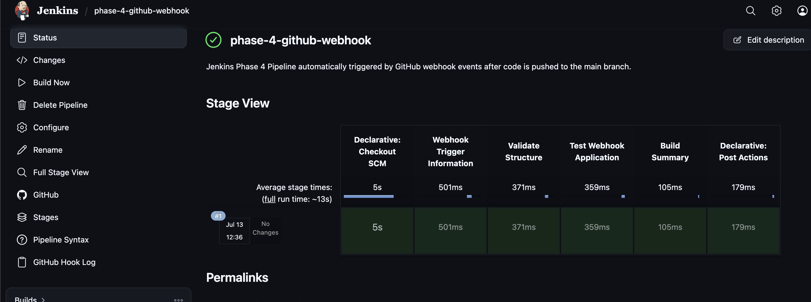
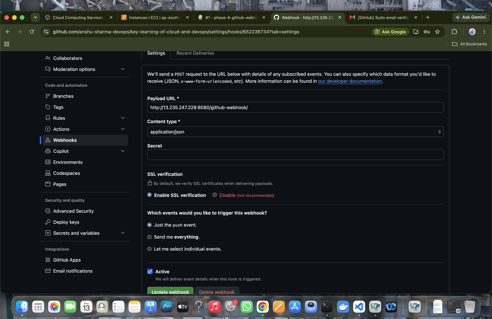
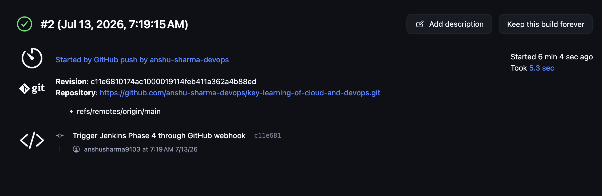
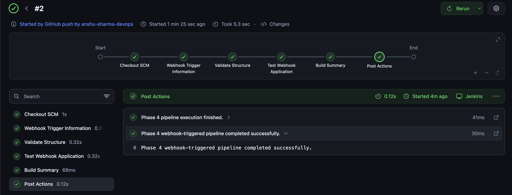
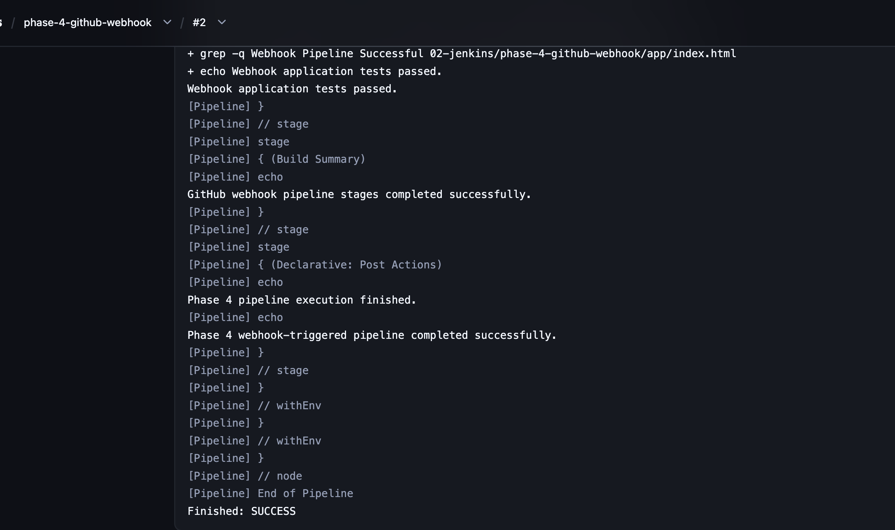
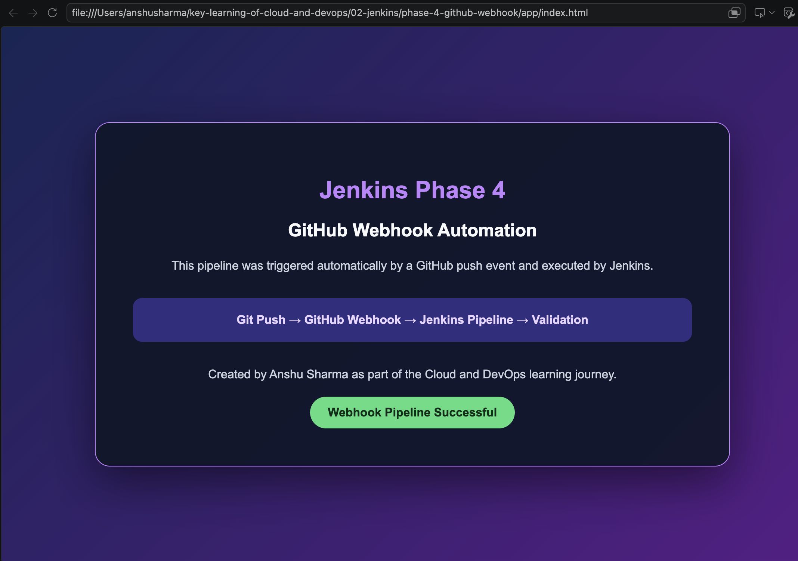

<div align="center">

# ⚙️ Jenkins Phase 4 — GitHub Webhook Automation

**Automatically triggering a Jenkins Declarative Pipeline whenever code is pushed to GitHub**

Part of the [Jenkins Learning Journey](../README.md)


</div>

---

## 📌 Project Overview

This phase demonstrates how to integrate GitHub with Jenkins using a repository webhook.

In Phase 3, the Declarative Pipeline had to be started manually using **Build Now**. In Phase 4, GitHub automatically sends a webhook request to Jenkins whenever code is pushed to the `main` branch.

Jenkins receives the push event, retrieves the latest `Jenkinsfile`, checks out the triggering commit and executes the complete validation Pipeline.

The Console Output confirmed:

```text
Started by GitHub push by anshu-sharma-devops
```

This proves that GitHub automatically triggered Jenkins without requiring a manual build.

---

## 🎯 Objectives

The objectives of this phase were to:

- Understand GitHub webhook automation.
- Connect a GitHub repository with Jenkins.
- Create a webhook-triggered Pipeline job.
- Enable the GitHub hook trigger.
- Configure push-event delivery.
- Trigger Jenkins automatically after a Git push.
- Load a version-controlled `Jenkinsfile`.
- Retrieve the latest Git commit.
- Validate an HTML application.
- Inspect the automatic Jenkins build.
- Understand webhook network and security requirements.
- Document the complete CI workflow.

---

## 🛠️ Technologies Used

| Technology | Purpose |
|---|---|
| Jenkins | Automated CI Pipeline execution |
| GitHub | Repository and webhook event source |
| Git | Source-code checkout and revision tracking |
| Jenkinsfile | Pipeline as Code definition |
| Groovy | Declarative Pipeline syntax |
| Shell | File and content validation |
| HTML5 | Static application used for validation |
| AWS EC2 | Reusable Jenkins controller |
| AWS Security Group | Jenkins network access control |
| Terraform | Previously used to provision Jenkins infrastructure |

---

## 🔄 Phase 3 vs Phase 4

| Phase 3 | Phase 4 |
|---|---|
| Pipeline started manually | Pipeline started automatically |
| User selected **Build Now** | Git push generated a webhook |
| Pipeline as Code | Event-driven Pipeline as Code |
| Manual CI execution | Automated CI execution |
| Jenkins retrieved the repository | Jenkins retrieved the triggering commit |

---

## 🏗️ Architecture

```text
Developer
    ↓
Git Commit
    ↓
Git Push
    ↓
GitHub Repository
    ↓
GitHub Push Event
    ↓
Webhook Request
    ↓
Jenkins Webhook Endpoint
    ↓
Declarative Pipeline
    ↓
Application Validation
    ↓
SUCCESS or FAILURE
```

---

## 📁 Project Structure

```text
phase-4-github-webhook/
├── app/
│   └── index.html
├── Jenkinsfile
├── README.md
├── screenshots/
│   ├── 01-manual-pipeline-success.png
│   ├── 02-github-webhook-configuration.png
│   ├── 03-webhook-pipeline-stage-view.png
│   ├── 04-automatic-build-triggered.png
│   ├── 05-webhook-console-success.png
│   └── 06-application-preview.png
└── TROUBLESHOOTING.md
```

---

## ☁️ Jenkins Infrastructure

This phase reused the Jenkins controller from the previous phases.

The controller runs on an Ubuntu 24.04 AWS EC2 instance and preserves:

- Jenkins jobs
- Installed plugins
- Pipeline configuration
- Build history
- Workspaces
- Future credentials and agent settings

The EC2 instance is stopped after practice instead of being destroyed.

> The EC2 public IPv4 address can change after a stop/start cycle.

---

## 🌐 Phase 4 Application

The static application is stored at:

```text
02-jenkins/phase-4-github-webhook/app/index.html
```

It represents the automated workflow:

```text
Git Push → GitHub Webhook → Jenkins Pipeline → Validation
```

Jenkins validates these required values:

```text
Jenkins Phase 4
GitHub Webhook Automation
Webhook Pipeline Successful
```

---

## ⚙️ Jenkins Pipeline Job

The following Pipeline job was created:

```text
phase-4-github-webhook
```

### Job Description

```text
Jenkins Phase 4 Pipeline automatically triggered by GitHub webhook
events after code is pushed to the main branch.
```

### Build Retention

```text
Days to keep builds: 7
Maximum number of builds to keep: 10
```

### Build Trigger

The following trigger was enabled:

```text
GitHub hook trigger for GITScm polling
```

This allows Jenkins to evaluate incoming GitHub webhook events and start the matching job.

---

## 🔧 Pipeline SCM Configuration

| Setting | Value |
|---|---|
| Definition | Pipeline script from SCM |
| SCM | Git |
| Repository URL | `https://github.com/anshu-sharma-devops/key-learning-of-cloud-and-devops.git` |
| Credentials | None — public repository |
| Branch Specifier | `*/main` |
| Script Path | `02-jenkins/phase-4-github-webhook/Jenkinsfile` |
| Lightweight Checkout | Enabled |

---

## 🧪 Manual Pipeline Test

Before enabling webhook automation, the Pipeline was tested manually.

This confirmed that:

- Jenkins could access GitHub.
- The Script Path was correct.
- The `Jenkinsfile` syntax was valid.
- The application files existed.
- All validation stages passed.
- The Pipeline completed successfully.



Testing manually first separated Pipeline validation from webhook configuration.

---

## 🔗 GitHub Webhook Configuration

The webhook was created from:

```text
GitHub Repository
→ Settings
→ Webhooks
→ Add webhook
```

### Webhook Settings

| Setting | Value |
|---|---|
| Payload URL | `http://JENKINS_PUBLIC_IP:8080/github-webhook/` |
| Content type | `application/json` |
| Events | Just the push event |
| Active | Enabled |

The required endpoint was:

```text
/github-webhook/
```

The final trailing slash was included.



---

## 📄 Jenkinsfile

The Pipeline is defined in:

```text
02-jenkins/phase-4-github-webhook/Jenkinsfile
```

```groovy
pipeline {
    agent any

    environment {
        APP_DIR = '02-jenkins/phase-4-github-webhook/app'
        APP_FILE = "${APP_DIR}/index.html"
    }

    stages {
        stage('Webhook Trigger Information') {
            steps {
                echo 'Pipeline triggered after a GitHub push event.'
                sh 'git log -1 --oneline'
            }
        }

        stage('Validate Structure') {
            steps {
                sh '''
                    set -e
                    test -d "$APP_DIR"
                    test -f "$APP_FILE"
                    echo "Application structure validation passed."
                '''
            }
        }

        stage('Test Webhook Application') {
            steps {
                sh '''
                    set -e
                    grep -q "Jenkins Phase 4" "$APP_FILE"
                    grep -q "GitHub Webhook Automation" "$APP_FILE"
                    grep -q "Webhook Pipeline Successful" "$APP_FILE"
                    echo "Webhook application tests passed."
                '''
            }
        }

        stage('Build Summary') {
            steps {
                echo 'GitHub webhook pipeline stages completed successfully.'
            }
        }
    }

    post {
        success {
            echo 'Phase 4 webhook-triggered pipeline completed successfully.'
        }

        failure {
            echo 'Phase 4 pipeline failed. Review the stage and console output.'
        }

        always {
            echo 'Phase 4 pipeline execution finished.'
        }
    }
}
```

---

## 🧩 Pipeline Stages

### Declarative: Checkout SCM

Jenkins automatically retrieves the repository because the job uses:

```text
Pipeline script from SCM
```

### Webhook Trigger Information

This stage prints the latest Git commit:

```bash
git log -1 --oneline
```

The automatic build displayed:

```text
c11e681 Trigger Jenkins Phase 4 through GitHub webhook
```

### Validate Structure

This stage verifies the application directory and file:

```bash
test -d "$APP_DIR"
test -f "$APP_FILE"
```

Successful output:

```text
Application structure validation passed.
```

### Test Webhook Application

This stage validates the required page content:

```bash
grep -q "Jenkins Phase 4" "$APP_FILE"
grep -q "GitHub Webhook Automation" "$APP_FILE"
grep -q "Webhook Pipeline Successful" "$APP_FILE"
```

Successful output:

```text
Webhook application tests passed.
```

### Build Summary

This stage confirms that all validation stages passed:

```text
GitHub webhook pipeline stages completed successfully.
```

### Post Actions

The `success` action printed:

```text
Phase 4 webhook-triggered pipeline completed successfully.
```

The `always` action printed:

```text
Phase 4 pipeline execution finished.
```

---

## 🚀 Automatic Webhook Test

The Phase 4 application was updated and pushed:

```bash
git add 02-jenkins/phase-4-github-webhook/app/index.html

git commit -m "Trigger Jenkins Phase 4 through GitHub webhook"

git push origin main
```

The Jenkins **Build Now** button was not used.

GitHub sent the push event to Jenkins, and Build `#2` started automatically.

The build information showed:

```text
Started by GitHub push by anshu-sharma-devops
```

It also showed the triggering revision and commit:

```text
Revision: c11e6810174ac1000019114feb411a362a4b88ed
Trigger Jenkins Phase 4 through GitHub webhook
```



---

## ✅ Successful Pipeline Stage View

All stages completed successfully:

- Checkout SCM
- Webhook Trigger Information
- Validate Structure
- Test Webhook Application
- Build Summary
- Post Actions



---

## ✅ Successful Console Output

The final Console Output included:

```text
Webhook application tests passed.
GitHub webhook pipeline stages completed successfully.
Phase 4 pipeline execution finished.
Phase 4 webhook-triggered pipeline completed successfully.
Finished: SUCCESS
```



---

## 🎉 Final Phase 4 Application

The final application represents the complete CI workflow:

```text
Git Push → GitHub Webhook → Jenkins Pipeline → Validation
```

It confirms that:

- The HTML application was completed.
- GitHub sent the push event.
- Jenkins received the webhook.
- The Pipeline started automatically.
- Jenkins retrieved the correct commit.
- All application checks passed.
- The Pipeline finished successfully.

The application displays:

```text
Webhook Pipeline Successful
```



<div align="center">

### ✅ Phase 4 Completed Successfully

</div>

---

## 📊 Pipeline Results

| Stage | Purpose | Result |
|---|---|---|
| Git push | Publish the application update | ✅ Completed |
| GitHub webhook | Notify Jenkins | ✅ Delivered |
| Checkout SCM | Retrieve repository code | ✅ SUCCESS |
| Webhook Trigger Information | Display latest commit | ✅ SUCCESS |
| Validate Structure | Verify directory and HTML file | ✅ SUCCESS |
| Test Webhook Application | Validate required content | ✅ SUCCESS |
| Build Summary | Confirm completion | ✅ SUCCESS |
| Post Actions | Print final result | ✅ SUCCESS |

Final result:

```text
Finished: SUCCESS
```

---

## 📸 Screenshot Evidence

| Screenshot | Evidence |
|---|---|
| `01-manual-pipeline-success.png` | Manual Pipeline test passed |
| `02-github-webhook-configuration.png` | GitHub webhook settings |
| `03-webhook-pipeline-stage-view.png` | All automated Pipeline stages passed |
| `04-automatic-build-triggered.png` | Build started automatically by GitHub |
| `05-webhook-console-success.png` | Final successful Console Output |
| `06-application-preview.png` | Completed Phase 4 application |

---

## 🔐 Security Considerations

During the learning test, port `8080` was temporarily accessible so GitHub could reach Jenkins.

After the test:

- Public `0.0.0.0/0` access was removed.
- Port `8080` was restricted back to **My IP**.
- Jenkins was not left publicly accessible.

A production webhook implementation should use:

- HTTPS
- A trusted TLS certificate
- A stable domain name
- A strong webhook secret
- GitHub IP allowlisting
- A reverse proxy
- Strong Jenkins authentication
- Separate Jenkins build agents

---

## 🧠 What I Learned

In this phase, I learned:

- What a GitHub webhook is.
- How event-driven CI works.
- How GitHub communicates with Jenkins.
- How to configure the `/github-webhook/` endpoint.
- How to enable the GitHub hook trigger.
- How a Git push can start Jenkins automatically.
- How to identify a webhook-triggered build.
- How Jenkins retrieves the triggering commit.
- How to validate application files and content.
- Why manual testing should happen before automation.
- Why Jenkins should not remain publicly exposed.
- Why production webhook endpoints require additional security.

---

## 🛠️ Troubleshooting

Troubleshooting guidance is available separately:

➡️ [View TROUBLESHOOTING.md](TROUBLESHOOTING.md)

---

## 💰 Cost Management

This phase reused the existing Jenkins EC2 instance.

After practice:

- The Jenkins instance is stopped.
- The instance is not destroyed.
- Jenkins jobs and build history remain on EBS.
- The new public IP is checked after restarting.
- The webhook URL must be updated if the public IP changes.

> Attached EBS storage may still incur a small charge depending on Free Tier eligibility and account usage.

---

## 🚀 Next Phase

### Phase 5 — Docker Build Pipeline

The next phase will introduce Docker into Jenkins:

- Create a Dockerfile.
- Verify Docker on the Jenkins server.
- Allow Jenkins to execute Docker commands.
- Build a Docker image.
- Run a container.
- Test the application.
- Clean old containers and images.

---

## ✅ Conclusion

Jenkins Phase 4 successfully implemented an automated GitHub webhook workflow.

A push to the `main` branch caused GitHub to notify Jenkins. Jenkins automatically retrieved the latest commit, loaded the version-controlled `Jenkinsfile`, validated the application and completed successfully.

The main evidence was:

```text
Started by GitHub push by anshu-sharma-devops
Finished: SUCCESS
```

This phase completed the transition from manually started Jenkins Pipelines to automated event-driven CI.

---

<div align="center">

**Created by Anshu Sharma**

*Cloud and DevOps Learning Journey*

**Phase 4 Status: ✅ Completed**

</div>