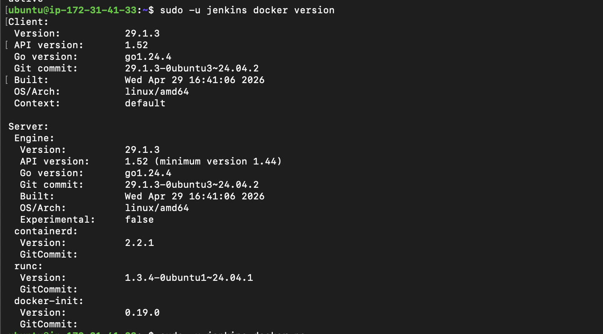
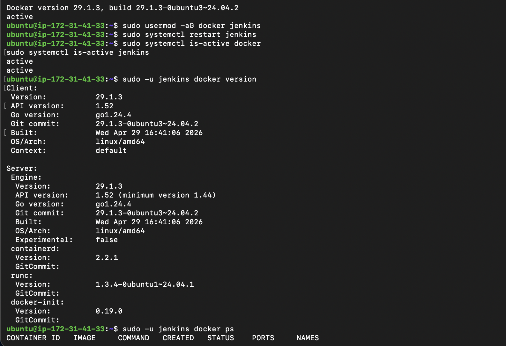
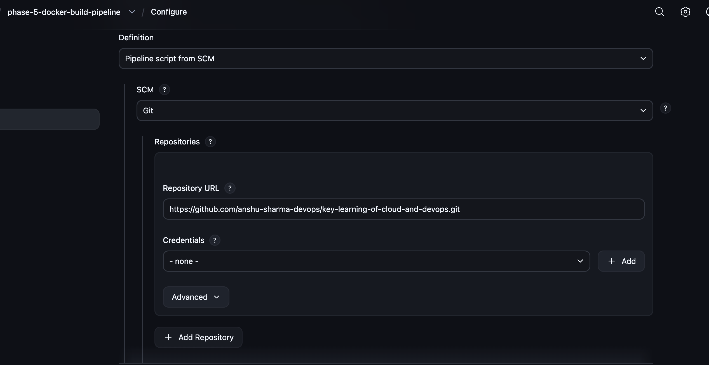
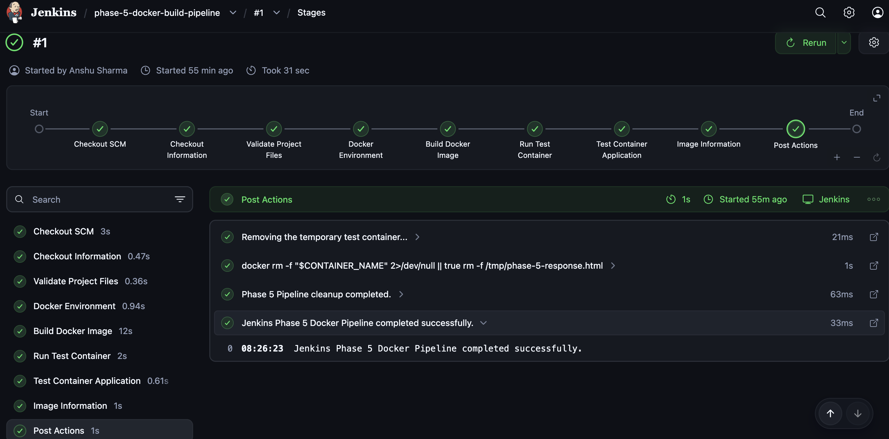
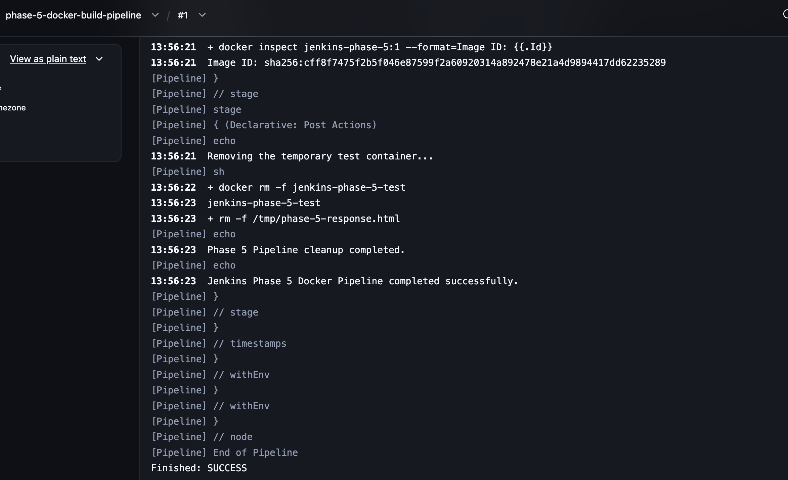
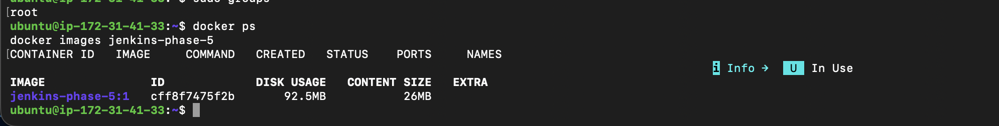
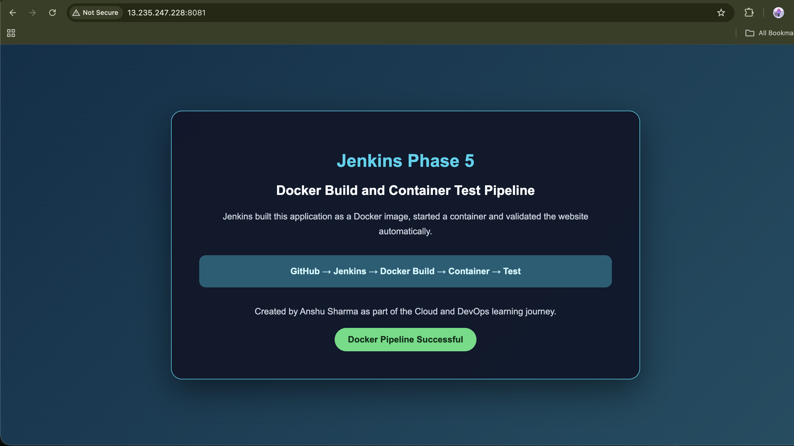
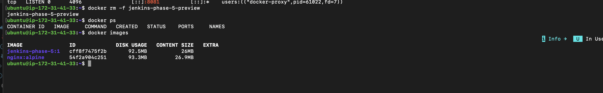

<div align="center">

# 🐳 Jenkins Phase 5 — Docker Build and Container Test Pipeline

**Building a Docker image, running a container and testing the application through a Jenkins Declarative Pipeline**

Part of the [Jenkins Learning Journey](../README.md)


</div>

---

## 📌 Project Overview

This phase integrates Docker into the Jenkins learning journey.

Jenkins retrieves the project from GitHub, validates the application files, builds an Nginx Docker image, starts a temporary container and tests the running website automatically.

The Pipeline verifies both the source files and the application returned by the container. After testing, Jenkins removes the temporary container while preserving the Docker image as build evidence.

The final Pipeline completed successfully:

```text
Jenkins Phase 5 Docker Pipeline completed successfully.
Phase 5 Pipeline cleanup completed.
Finished: SUCCESS
```

---

## 🎯 Objectives

The objectives of this phase were to:

- Integrate Docker with Jenkins.
- Allow the Jenkins Linux user to access Docker.
- Create a lightweight Nginx Docker image.
- Store the Docker build instructions in a `Dockerfile`.
- Store the CI workflow in a `Jenkinsfile`.
- Build a versioned Docker image through Jenkins.
- Run a temporary test container.
- Map a host port to container port `80`.
- Test the container with `curl`.
- Validate content served from inside the container.
- Inspect the Docker image produced by Jenkins.
- Remove temporary containers automatically.
- Document Docker permission and network errors.

---

## 🛠️ Technologies Used

| Technology | Purpose |
|---|---|
| Jenkins | Pipeline orchestration |
| Docker | Image creation and container execution |
| Nginx Alpine | Lightweight application web server |
| GitHub | Source-code repository |
| Git | Repository checkout and commit information |
| Jenkinsfile | Pipeline as Code |
| Groovy | Declarative Pipeline syntax |
| Shell | Validation and Docker commands |
| curl | HTTP application testing |
| HTML5 | Static website |
| AWS EC2 | Jenkins and Docker host |
| AWS Security Group | Temporary access to container port `8081` |

---

## 🏗️ Pipeline Architecture

```text
GitHub Repository
        ↓
Jenkins Checkout
        ↓
Project File Validation
        ↓
Docker Environment Check
        ↓
Docker Image Build
        ↓
Temporary Test Container
        ↓
HTTP and Content Tests
        ↓
Image Information
        ↓
Container Cleanup
```

---

## 📁 Project Structure

```text
phase-5-docker-build-pipeline/
├── app/
│   └── index.html
├── Dockerfile
├── Jenkinsfile
├── README.md
├── screenshots/
│   ├── 01-docker-version.png
│   ├── 02-jenkins-docker-permission.png
│   ├── 03-pipeline-scm-configuration.png
│   ├── 04-docker-pipeline-stage-view.png
│   ├── 05-docker-build-console-output.png
│   ├── 06-docker-image-on-server.png
│   ├── 07-container-application-preview.png
│   └── 08-container-cleanup.png
└── TROUBLESHOOTING.md
```

---

## ☁️ Jenkins Infrastructure

This phase reused the existing Jenkins controller hosted on an Ubuntu 24.04 AWS EC2 instance.

Docker and Jenkins ran on the same learning server.

The server preserves:

- Jenkins jobs
- Pipeline build history
- Installed plugins
- Docker images
- Pipeline workspaces
- Future credentials and agent configuration

The EC2 instance is stopped after practice instead of being destroyed.

> Running builds directly on the Jenkins controller is acceptable for this learning environment. Production environments should use dedicated Jenkins agents.

---

## 🐳 Docker Environment

Docker was already installed on the Jenkins server.

Version:

```text
Docker version 29.1.3
```

The Docker service was active:

```text
active
```

Docker Engine components included:

```text
Docker Engine: 29.1.3
containerd: 2.2.1
runc: 1.3.4
```



---

## 🔐 Jenkins Docker Permission

Jenkins runs under the Linux user:

```text
jenkins
```

The Jenkins user was added to the Docker group:

```bash
sudo usermod -aG docker jenkins
```

Jenkins was restarted so the new group membership could take effect:

```bash
sudo systemctl restart jenkins
```

Both services were verified:

```bash
sudo systemctl is-active docker
sudo systemctl is-active jenkins
```

Expected:

```text
active
active
```

Docker access was tested as the Jenkins user:

```bash
sudo -u jenkins docker version
sudo -u jenkins docker ps
```

Both commands completed without a Docker socket permission error.



> Membership in the Docker group provides powerful root-equivalent access. A production environment should use isolated and controlled build agents.

---

## 🌐 Phase 5 Application

The application is stored at:

```text
02-jenkins/phase-5-docker-build-pipeline/app/index.html
```

It represents the Docker CI workflow:

```text
GitHub → Jenkins → Docker Build → Container → Test
```

The Pipeline checks for:

```text
Jenkins Phase 5
Docker Pipeline Successful
```

---

## 📦 Dockerfile

The Dockerfile uses the lightweight Nginx Alpine image:

```dockerfile
FROM nginx:alpine

LABEL maintainer="Anshu Sharma"
LABEL project="Jenkins Phase 5 Docker Pipeline"

COPY app/index.html /usr/share/nginx/html/index.html

EXPOSE 80

HEALTHCHECK --interval=10s --timeout=3s --start-period=5s --retries=3 \
    CMD wget --quiet --tries=1 --spider http://localhost/ || exit 1
```

### Dockerfile Explanation

| Instruction | Purpose |
|---|---|
| `FROM nginx:alpine` | Uses lightweight Nginx as the base image |
| `LABEL` | Adds project metadata |
| `COPY` | Copies the custom HTML page into Nginx |
| `EXPOSE 80` | Documents the container web port |
| `HEALTHCHECK` | Checks whether Nginx responds successfully |

---

## ⚙️ Jenkins Pipeline Job

The following Pipeline job was created:

```text
phase-5-docker-build-pipeline
```

### Job Description

```text
Jenkins Phase 5 Pipeline that builds an Nginx Docker image,
runs a temporary container and validates the application automatically.
```

### SCM Configuration

| Setting | Value |
|---|---|
| Definition | Pipeline script from SCM |
| SCM | Git |
| Repository | `https://github.com/anshu-sharma-devops/key-learning-of-cloud-and-devops.git` |
| Credentials | None — public repository |
| Branch | `*/main` |
| Script Path | `02-jenkins/phase-5-docker-build-pipeline/Jenkinsfile` |
| Lightweight Checkout | Enabled |



---

## 📄 Jenkinsfile

The Jenkinsfile defines the complete Docker CI workflow:

```groovy
pipeline {
    agent any

    options {
        disableConcurrentBuilds()
        timestamps()
    }

    environment {
        PROJECT_DIR    = '02-jenkins/phase-5-docker-build-pipeline'
        APP_FILE       = "${PROJECT_DIR}/app/index.html"
        DOCKERFILE     = "${PROJECT_DIR}/Dockerfile"
        IMAGE_NAME     = 'jenkins-phase-5'
        CONTAINER_NAME = 'jenkins-phase-5-test'
        TEST_PORT      = '8081'
    }

    stages {
        stage('Checkout Information') {
            steps {
                echo 'Displaying the Git commit used for this build...'
                sh 'git log -1 --oneline'
            }
        }

        stage('Validate Project Files') {
            steps {
                sh '''
                    set -e

                    test -d "$PROJECT_DIR"
                    test -f "$APP_FILE"
                    test -f "$DOCKERFILE"

                    grep -q "Jenkins Phase 5" "$APP_FILE"
                    grep -q "Docker Pipeline Successful" "$APP_FILE"
                    grep -q "FROM nginx:alpine" "$DOCKERFILE"

                    echo "Project file validation passed."
                '''
            }
        }

        stage('Docker Environment') {
            steps {
                sh '''
                    set -e

                    docker --version
                    docker info > /dev/null

                    echo "Docker is available to the Jenkins user."
                '''
            }
        }

        stage('Build Docker Image') {
            steps {
                sh '''
                    set -e

                    docker build \
                        --tag "$IMAGE_NAME:$BUILD_NUMBER" \
                        "$PROJECT_DIR"

                    echo "Docker image built successfully."
                '''
            }
        }

        stage('Run Test Container') {
            steps {
                sh '''
                    set -e

                    docker rm -f "$CONTAINER_NAME" 2>/dev/null || true

                    docker run \
                        --detach \
                        --name "$CONTAINER_NAME" \
                        --publish "127.0.0.1:$TEST_PORT:80" \
                        "$IMAGE_NAME:$BUILD_NUMBER"

                    docker ps --filter "name=$CONTAINER_NAME"

                    echo "Docker container started successfully."
                '''
            }
        }

        stage('Test Container Application') {
            steps {
                sh '''
                    set -e

                    ATTEMPT=1

                    while [ "$ATTEMPT" -le 10 ]; do
                        if curl --fail --silent \
                            "http://127.0.0.1:$TEST_PORT" \
                            > /tmp/phase-5-response.html; then
                            break
                        fi

                        echo "Waiting for the container... Attempt $ATTEMPT"
                        ATTEMPT=$((ATTEMPT + 1))
                        sleep 2
                    done

                    test -s /tmp/phase-5-response.html

                    grep -q "Jenkins Phase 5" \
                        /tmp/phase-5-response.html

                    grep -q "Docker Pipeline Successful" \
                        /tmp/phase-5-response.html

                    echo "Container application test passed."
                '''
            }
        }

        stage('Image Information') {
            steps {
                sh '''
                    docker image ls "$IMAGE_NAME:$BUILD_NUMBER"

                    docker inspect "$IMAGE_NAME:$BUILD_NUMBER" \
                        --format='Image ID: {{.Id}}'
                '''
            }
        }
    }

    post {
        success {
            echo 'Jenkins Phase 5 Docker Pipeline completed successfully.'
        }

        failure {
            echo 'Jenkins Phase 5 Docker Pipeline failed. Review the failed stage.'
        }

        always {
            echo 'Removing the temporary test container...'

            sh '''
                docker rm -f "$CONTAINER_NAME" 2>/dev/null || true
                rm -f /tmp/phase-5-response.html
            '''

            echo 'Phase 5 Pipeline cleanup completed.'
        }
    }
}
```

---

## 🧩 Pipeline Stage Explanation

### Checkout SCM

Jenkins retrieves the GitHub repository and loads the Phase 5 `Jenkinsfile`.

### Checkout Information

Displays the exact Git commit used for the build:

```bash
git log -1 --oneline
```

### Validate Project Files

Confirms that:

- The Phase 5 directory exists.
- `index.html` exists.
- The Dockerfile exists.
- Required HTML text exists.
- The Dockerfile uses `nginx:alpine`.

### Docker Environment

Runs:

```bash
docker --version
docker info
```

This proves Jenkins can communicate with Docker Engine.

### Build Docker Image

Builds the image:

```bash
docker build \
  --tag jenkins-phase-5:$BUILD_NUMBER \
  02-jenkins/phase-5-docker-build-pipeline
```

Build `#1` produced:

```text
jenkins-phase-5:1
```

### Run Test Container

Runs the image as a temporary container:

```text
jenkins-phase-5-test
```

The Pipeline maps:

```text
127.0.0.1:8081 → container port 80
```

Binding to `127.0.0.1` keeps the automated test port local to the Jenkins server.

### Test Container Application

Jenkins sends an HTTP request:

```bash
curl http://127.0.0.1:8081
```

It then validates the returned HTML.

### Image Information

Displays the image tag and immutable image ID.

### Post Actions

The `always` section removes:

- The temporary test container.
- The temporary HTTP response file.

The image is retained as build evidence.

---

## ✅ Successful Pipeline Execution

All Pipeline stages passed:

- Checkout SCM
- Checkout Information
- Validate Project Files
- Docker Environment
- Build Docker Image
- Run Test Container
- Test Container Application
- Image Information
- Post Actions



---

## 🧹 Pipeline Cleanup

The Console Output confirmed that Jenkins removed the temporary container:

```text
Removing the temporary test container...
docker rm -f jenkins-phase-5-test
Phase 5 Pipeline cleanup completed.
Jenkins Phase 5 Docker Pipeline completed successfully.
Finished: SUCCESS
```



---

## 🖼️ Docker Image Evidence

The image remained on the Jenkins server:

```text
jenkins-phase-5:1
```

Image information:

```text
Image ID: cff8f7475f2b
Disk usage: 92.5 MB
Content size: 26 MB
```



---

## 🌍 Container Application Preview

For final visual verification, the image was started temporarily:

```bash
docker run -d \
  --name jenkins-phase-5-preview \
  -p 8081:80 \
  jenkins-phase-5:1
```

The container became healthy and the application was opened at:

```text
http://JENKINS_PUBLIC_IP:8081
```



---

## 🧹 Final Cleanup

After visual verification, both temporary container names were removed:

```bash
docker rm -f jenkins-phase-5-preview 2>/dev/null || true
docker rm -f jenkins-phase-5-test 2>/dev/null || true
```

Cleanup was verified:

```bash
docker ps -a --filter "name=jenkins-phase-5"
```

The empty result confirmed that no Phase 5 container remained.



The temporary EC2 security-group rule for port `8081` was also removed.

---

## 📊 Final Results

| Component | Result |
|---|---|
| Docker Engine | ✅ Active |
| Jenkins Docker access | ✅ Working |
| Project validation | ✅ Passed |
| Docker image build | ✅ Passed |
| Test container | ✅ Started |
| HTTP test | ✅ Passed |
| Content validation | ✅ Passed |
| Image retained | ✅ Confirmed |
| Temporary containers | ✅ Removed |
| Final Pipeline | ✅ SUCCESS |

---

## 🧠 What I Learned

In this phase, I learned:

- How Jenkins communicates with Docker.
- Why Jenkins needs access to `/var/run/docker.sock`.
- How Linux Docker-group permissions work.
- How to create an Nginx Dockerfile.
- How to build images from a Jenkinsfile.
- How to tag images using the Jenkins build number.
- How to run containers from a Pipeline.
- How host-to-container port mapping works.
- How to test a running container with `curl`.
- How to validate the HTML returned by Nginx.
- How Docker health checks work.
- How to perform Pipeline cleanup with `post { always { ... } }`.
- Why production builds should use dedicated Jenkins agents.

---

## 🛠️ Troubleshooting

Errors and fixes encountered in this phase are documented separately:

➡️ [View TROUBLESHOOTING.md](TROUBLESHOOTING.md)

Documented problems include:

- Docker permission denied for the Ubuntu user.
- Group membership not applying in the existing SSH session.
- Incorrect `curl config` command.
- Container not opening from the browser.
- Missing security-group rule for port `8081`.

---

## 💰 Cost Management

This phase reused the existing Jenkins EC2 instance.

After practice:

- Temporary containers were removed.
- The temporary `8081` security-group rule was removed.
- The Jenkins instance is stopped instead of destroyed.
- Jenkins configuration and Docker image evidence remain available.

The Docker image may be removed later if disk space becomes limited:

```bash
docker image rm jenkins-phase-5:1
```

---

## 🚀 Next Phase

### Phase 6 — Docker Registry Pipeline

The next phase can extend the Pipeline by:

- Tagging the image for Docker Hub.
- Storing Docker Hub credentials securely in Jenkins.
- Logging in without exposing the password.
- Pushing the image to Docker Hub.
- Pulling and verifying the published image.

---

## ✅ Conclusion

Jenkins Phase 5 successfully integrated Docker with the CI Pipeline.

Jenkins retrieved the application from GitHub, built an Nginx Docker image, ran a temporary container, tested the website, displayed image information and cleaned up the test environment.

Final result:

```text
Jenkins Phase 5 Docker Pipeline completed successfully.
Finished: SUCCESS
```

---

<div align="center">

**Created by Anshu Sharma**

*Cloud and DevOps Learning Journey*

**Phase 5 Status: ✅ Completed**

</div>