<div align="center">

# 🐳 Jenkins Phase 6 — Docker Hub Registry Pipeline

**Securely building, testing, tagging and publishing Docker images through Jenkins**

Part of the [Jenkins Learning Journey](../README.md)


</div>

---

## 📌 Project Overview

This phase extends the Jenkins Docker Pipeline by publishing tested Docker images to Docker Hub.

Jenkins retrieves the project from GitHub, validates the source files, builds an Nginx Docker image and starts a temporary container. The running application is tested before publication.

After all tests pass, Jenkins securely retrieves a Docker Hub access token from Jenkins Credentials, logs in to Docker Hub and publishes two image tags:

```text
anshu9103/jenkins-phase-6:1
anshu9103/jenkins-phase-6:latest
```

The Pipeline logs out from Docker Hub and removes the temporary test container during cleanup.

Final result:

```text
Jenkins Phase 6 Docker Hub Pipeline completed successfully.
Phase 6 Pipeline cleanup completed.
Finished: SUCCESS
```

---

## 🎯 Objectives

The objectives of this phase were to:

- Create a public Docker Hub repository.
- Generate a Docker Hub personal access token.
- Store the token securely inside Jenkins.
- Reference Jenkins credentials without exposing the token.
- Build a Docker image through Jenkins.
- Tag the image with the Jenkins build number.
- Create a reusable `latest` tag.
- Start and test a temporary container.
- Publish versioned and latest images.
- Verify published tags on Docker Hub.
- Pull and run the published image.
- Log out and clean temporary resources.
- Understand Docker registry security.

---

## 🛠️ Technologies Used

| Technology | Purpose |
|---|---|
| Jenkins | CI Pipeline orchestration |
| Docker | Image building, tagging, testing and publishing |
| Docker Hub | Public container image registry |
| Nginx Alpine | Lightweight application image |
| GitHub | Source-code repository |
| Git | Repository checkout and revision tracking |
| Jenkinsfile | Pipeline as Code |
| Groovy | Declarative Pipeline syntax |
| Jenkins Credentials | Secure token storage |
| Shell | Docker and validation commands |
| curl | HTTP container testing |
| HTML5 | Static web application |
| AWS EC2 | Jenkins and Docker host |
| AWS Security Group | Temporary browser access to port `8082` |

---

## 🏗️ Pipeline Architecture

```text
Developer
    ↓
GitHub Repository
    ↓
Jenkins Checkout
    ↓
Project Validation
    ↓
Docker Image Build
    ↓
Temporary Container
    ↓
HTTP Application Test
    ↓
Jenkins Credentials
    ↓
Secure Docker Hub Login
    ↓
Push Version Tag
    ↓
Push Latest Tag
    ↓
Docker Hub Repository
    ↓
Cleanup and Logout
```

---

## 📁 Project Structure

```text
phase-6-dockerhub-registry-pipeline/
├── app/
│   └── index.html
├── Dockerfile
├── Jenkinsfile
├── README.md
├── screenshots/
│   ├── 01-dockerhub-credential-created.png
│   ├── 02-pipeline-scm-configuration.png
│   ├── 03-docker-pipeline-stage-view.png
│   ├── 04-container-test-success.png
│   ├── 05-dockerhub-login-success.png
│   ├── 06-versioned-image-push.png
│   ├── 07-latest-image-push.png
│   ├── 08-published-image-summary.png
│   ├── 09-dockerhub-tags.png
│   ├── 10-pipeline-cleanup-success.png
│   └── 11-container-application-preview.png
└── TROUBLESHOOTING.md
```

---

## ☁️ Jenkins Infrastructure

This phase reused the existing Jenkins controller running on an Ubuntu 24.04 AWS EC2 instance.

The same server contains:

- Jenkins
- Docker Engine
- Jenkins Pipeline jobs
- Docker images
- Build history
- Jenkins Credentials
- Pipeline workspaces

The EC2 instance is stopped after practice instead of being destroyed.

> A production environment should execute Docker builds on dedicated Jenkins agents instead of the controller.

---

## 🐳 Docker Hub Repository

A public Docker Hub repository was created:

```text
anshu9103/jenkins-phase-6
```

Repository URL:

```text
https://hub.docker.com/r/anshu9103/jenkins-phase-6
```

The repository stores the Docker images produced by Jenkins.

---

## 🔑 Docker Hub Access Token

A Docker Hub personal access token was created for CI automation.

Configuration:

```text
Description: jenkins-phase-6
Permissions: Read and Write
```

The token was copied once and stored in Jenkins.

It was not added to:

- GitHub
- `Jenkinsfile`
- `README.md`
- Shell scripts
- Screenshots
- Console Output

---

## 🔐 Jenkins Credential

The Docker Hub token was stored as a Jenkins credential:

| Field | Value |
|---|---|
| Kind | Username with password |
| Scope | Global |
| Username | `anshu9103` |
| Password | Docker Hub access token |
| ID | `dockerhub-credentials` |
| Description | Docker Hub credentials for Jenkins Phase 6 |

The credential ID used by the Jenkinsfile is:

```text
dockerhub-credentials
```

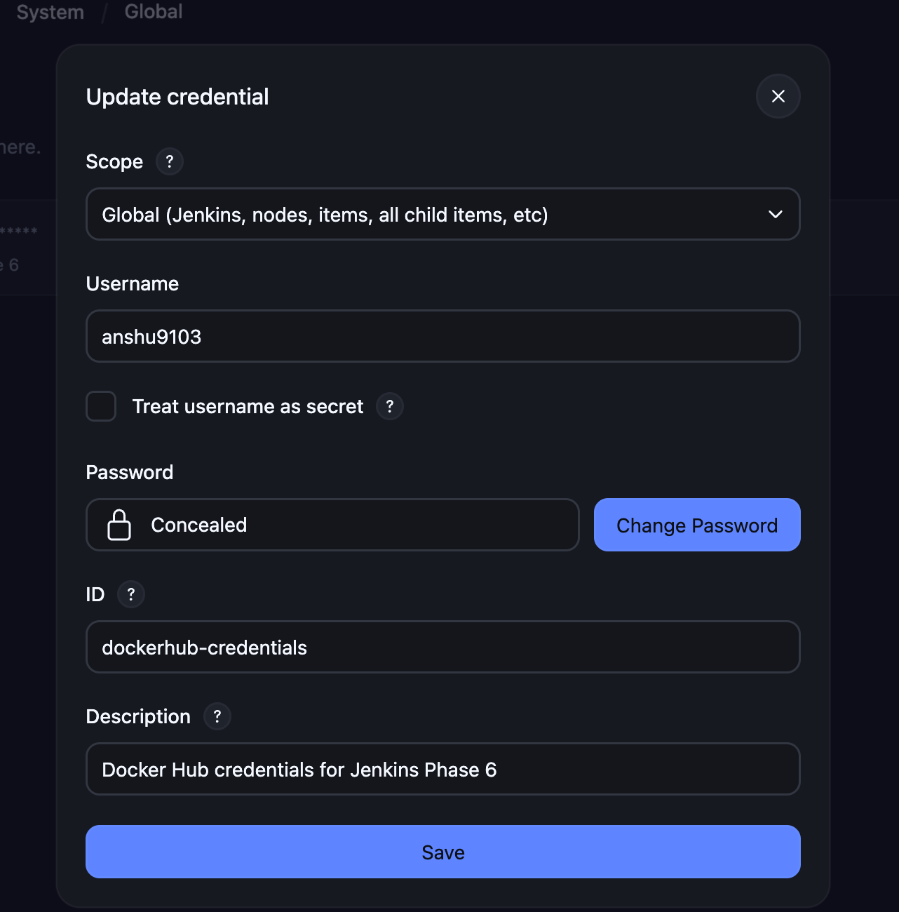

> The credential screenshot displays only the credential record and never the token value.

---

## 🌐 Phase 6 Application

The application is stored at:

```text
02-jenkins/phase-6-dockerhub-registry-pipeline/app/index.html
```

It represents the workflow:

```text
GitHub → Jenkins → Docker Build → Test → Docker Hub
```

Required application values:

```text
Jenkins Phase 6
Docker Hub Registry Pipeline
Registry Pipeline Successful
anshu9103/jenkins-phase-6
```

---

## 📦 Dockerfile

```dockerfile
FROM nginx:alpine

LABEL maintainer="Anshu Sharma"
LABEL project="Jenkins Phase 6 Docker Hub Registry Pipeline"

COPY app/index.html /usr/share/nginx/html/index.html

EXPOSE 80

HEALTHCHECK --interval=10s --timeout=3s --start-period=5s --retries=3 \
    CMD wget --quiet --tries=1 --spider http://localhost/ || exit 1
```

### Dockerfile Explanation

| Instruction | Purpose |
|---|---|
| `FROM nginx:alpine` | Uses a lightweight Nginx image |
| `LABEL` | Adds maintainer and project metadata |
| `COPY` | Copies the custom application into Nginx |
| `EXPOSE 80` | Documents the application port |
| `HEALTHCHECK` | Verifies that Nginx responds inside the container |

---

## ⚙️ Jenkins Job Configuration

The following Pipeline job was created:

```text
phase-6-dockerhub-registry-pipeline
```

### SCM Configuration

| Setting | Value |
|---|---|
| Definition | Pipeline script from SCM |
| SCM | Git |
| Repository | `https://github.com/anshu-sharma-devops/key-learning-of-cloud-and-devops.git` |
| Credentials | None — public repository |
| Branch | `*/main` |
| Script Path | `02-jenkins/phase-6-dockerhub-registry-pipeline/Jenkinsfile` |
| Lightweight Checkout | Enabled |

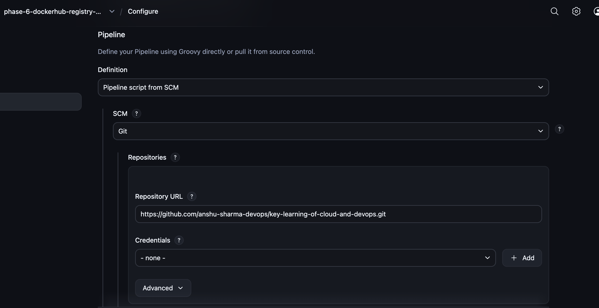

---

## 📄 Jenkinsfile

```groovy
pipeline {
    agent any

    options {
        disableConcurrentBuilds()
        timestamps()
    }

    environment {
        PROJECT_DIR      = '02-jenkins/phase-6-dockerhub-registry-pipeline'
        APP_FILE         = "${PROJECT_DIR}/app/index.html"
        DOCKERFILE       = "${PROJECT_DIR}/Dockerfile"
        IMAGE_REPOSITORY = 'anshu9103/jenkins-phase-6'
        VERSION_TAG      = "${BUILD_NUMBER}"
        CONTAINER_NAME   = 'jenkins-phase-6-test'
        TEST_PORT        = '8082'
    }

    stages {
        stage('Checkout Information') {
            steps {
                echo 'Displaying the Git commit used for this build...'
                sh 'git log -1 --oneline'
            }
        }

        stage('Validate Project Files') {
            steps {
                sh '''
                    set -e

                    test -d "$PROJECT_DIR"
                    test -f "$APP_FILE"
                    test -f "$DOCKERFILE"

                    grep -q "Jenkins Phase 6" "$APP_FILE"
                    grep -q "Docker Hub Registry Pipeline" "$APP_FILE"
                    grep -q "Registry Pipeline Successful" "$APP_FILE"
                    grep -q "FROM nginx:alpine" "$DOCKERFILE"

                    echo "Phase 6 project validation passed."
                '''
            }
        }

        stage('Docker Environment') {
            steps {
                sh '''
                    set -e

                    docker --version
                    docker info > /dev/null

                    echo "Docker is available to Jenkins."
                '''
            }
        }

        stage('Build Docker Image') {
            steps {
                sh '''
                    set -e

                    docker build \
                        --tag "$IMAGE_REPOSITORY:$VERSION_TAG" \
                        "$PROJECT_DIR"

                    docker tag \
                        "$IMAGE_REPOSITORY:$VERSION_TAG" \
                        "$IMAGE_REPOSITORY:latest"

                    echo "Docker images built and tagged successfully."
                '''
            }
        }

        stage('Run Test Container') {
            steps {
                sh '''
                    set -e

                    docker rm -f "$CONTAINER_NAME" 2>/dev/null || true

                    docker run \
                        --detach \
                        --name "$CONTAINER_NAME" \
                        --publish "127.0.0.1:$TEST_PORT:80" \
                        "$IMAGE_REPOSITORY:$VERSION_TAG"

                    docker ps --filter "name=$CONTAINER_NAME"

                    echo "Phase 6 test container started."
                '''
            }
        }

        stage('Test Container Application') {
            steps {
                sh '''
                    set -e

                    ATTEMPT=1

                    while [ "$ATTEMPT" -le 10 ]; do
                        if curl --fail --silent \
                            "http://127.0.0.1:$TEST_PORT" \
                            > /tmp/phase-6-response.html; then
                            break
                        fi

                        echo "Waiting for container... Attempt $ATTEMPT"
                        ATTEMPT=$((ATTEMPT + 1))
                        sleep 2
                    done

                    test -s /tmp/phase-6-response.html

                    grep -q "Jenkins Phase 6" \
                        /tmp/phase-6-response.html

                    grep -q "Registry Pipeline Successful" \
                        /tmp/phase-6-response.html

                    echo "Phase 6 container application test passed."
                '''
            }
        }

        stage('Docker Hub Login') {
            steps {
                withCredentials([
                    usernamePassword(
                        credentialsId: 'dockerhub-credentials',
                        usernameVariable: 'DOCKERHUB_USERNAME',
                        passwordVariable: 'DOCKERHUB_TOKEN'
                    )
                ]) {
                    sh '''
                        set +x

                        echo "$DOCKERHUB_TOKEN" |
                            docker login \
                                --username "$DOCKERHUB_USERNAME" \
                                --password-stdin

                        echo "Docker Hub login completed successfully."
                    '''
                }
            }
        }

        stage('Push Versioned Image') {
            steps {
                sh '''
                    set -e

                    docker push "$IMAGE_REPOSITORY:$VERSION_TAG"

                    echo "Versioned Docker image pushed successfully."
                '''
            }
        }

        stage('Push Latest Image') {
            steps {
                sh '''
                    set -e

                    docker push "$IMAGE_REPOSITORY:latest"

                    echo "Latest Docker image pushed successfully."
                '''
            }
        }

        stage('Published Image Summary') {
            steps {
                sh '''
                    docker image ls "$IMAGE_REPOSITORY"

                    echo "Published versioned image:"
                    echo "$IMAGE_REPOSITORY:$VERSION_TAG"

                    echo "Published latest image:"
                    echo "$IMAGE_REPOSITORY:latest"
                '''
            }
        }
    }

    post {
        success {
            echo 'Jenkins Phase 6 Docker Hub Pipeline completed successfully.'
        }

        failure {
            echo 'Jenkins Phase 6 Pipeline failed. Review the failed stage.'
        }

        always {
            sh '''
                docker rm -f "$CONTAINER_NAME" 2>/dev/null || true
                rm -f /tmp/phase-6-response.html
                docker logout 2>/dev/null || true
            '''

            echo 'Phase 6 Pipeline cleanup completed.'
        }
    }
}
```

---

## 🧩 Pipeline Stages

### Checkout SCM

Retrieves the repository and Phase 6 Jenkinsfile.

### Checkout Information

Displays the Git commit used by Jenkins:

```text
ee48bb1 Add Jenkins Phase 6 Docker Hub registry pipeline
```

### Validate Project Files

Confirms:

- Project directory exists.
- HTML application exists.
- Dockerfile exists.
- Required application values exist.
- Base image is `nginx:alpine`.

### Docker Environment

Verifies Docker Engine:

```text
Docker version 29.1.3
Docker is available to Jenkins.
```

### Build Docker Image

Builds:

```text
anshu9103/jenkins-phase-6:1
```

Then creates:

```text
anshu9103/jenkins-phase-6:latest
```

### Run Test Container

Runs:

```text
jenkins-phase-6-test
```

Port mapping:

```text
127.0.0.1:8082 → container port 80
```

### Test Container Application

Tests the website using:

```bash
curl --fail --silent http://127.0.0.1:8082
```

It then checks:

```text
Jenkins Phase 6
Registry Pipeline Successful
```

Successful output:

```text
Phase 6 container application test passed.
```

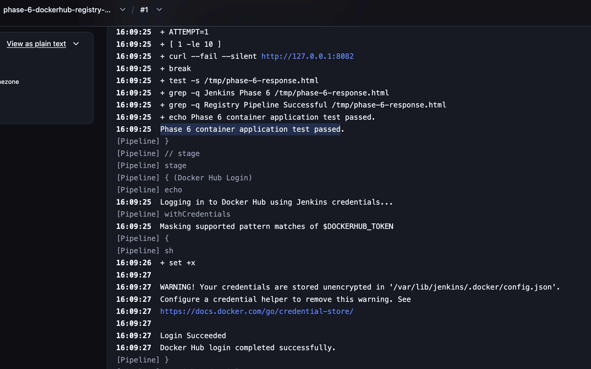

### Docker Hub Login

Loads the credential:

```text
dockerhub-credentials
```

The Console Output confirmed:

```text
Masking supported pattern matches of $DOCKERHUB_TOKEN
Login Succeeded
Docker Hub login completed successfully.
```

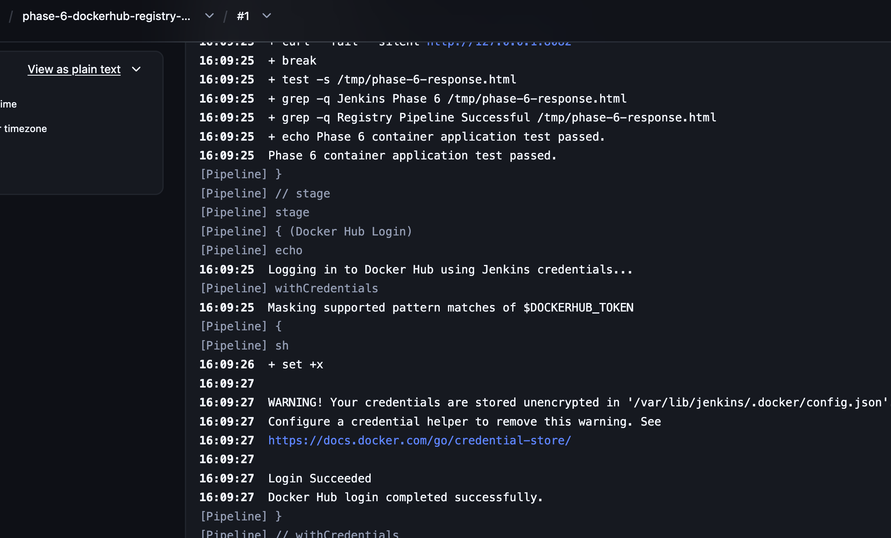

### Push Versioned Image

Publishes:

```text
anshu9103/jenkins-phase-6:1
```

Digest:

```text
sha256:7c7007815313d03d6f667239f12d4b930d205965114f45094ed9692e85daf221
```

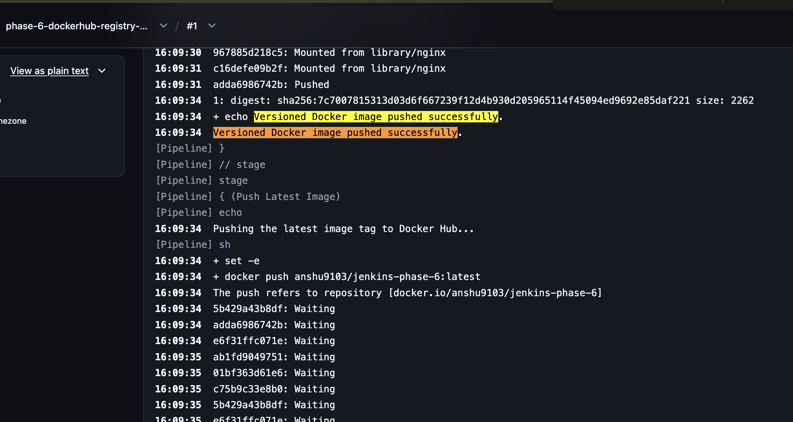

### Push Latest Image

Publishes:

```text
anshu9103/jenkins-phase-6:latest
```

Both tags point to the same image digest.

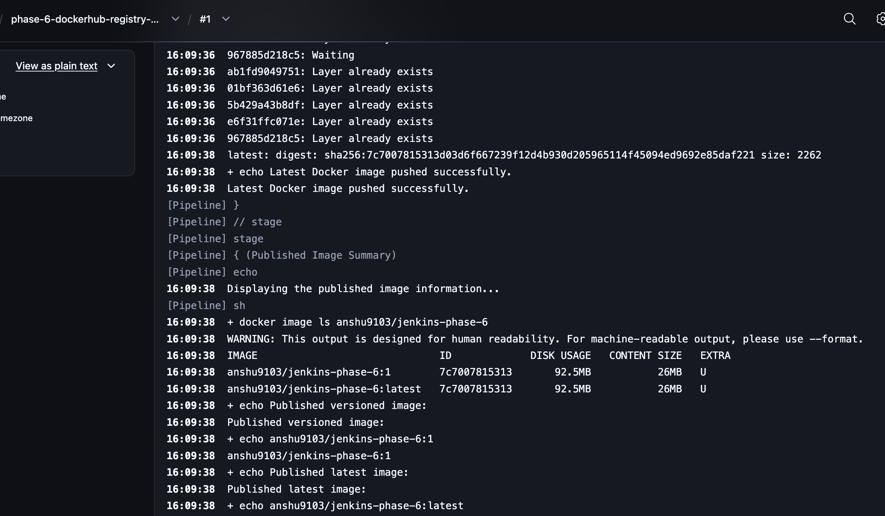

### Published Image Summary

Jenkins displayed:

```text
anshu9103/jenkins-phase-6:1
anshu9103/jenkins-phase-6:latest
```

Image information:

```text
Image ID: 7c7007815313
Disk usage: 92.5 MB
Content size: 26 MB
```

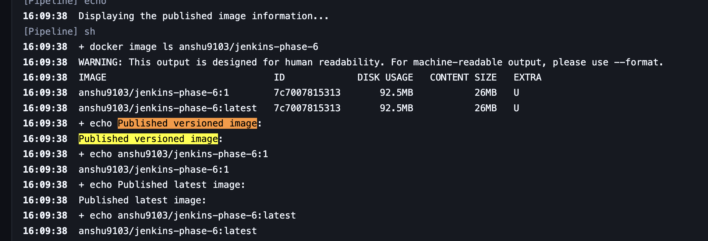

### Post Actions

Jenkins removed the test container, deleted the temporary response and logged out:

```text
docker rm -f jenkins-phase-6-test
rm -f /tmp/phase-6-response.html
docker logout
```

---

## ✅ Complete Pipeline Execution

All Pipeline stages completed successfully:

```text
Checkout SCM
Checkout Information
Validate Project Files
Docker Environment
Build Docker Image
Run Test Container
Test Container Application
Docker Hub Login
Push Versioned Image
Push Latest Image
Published Image Summary
Post Actions
```

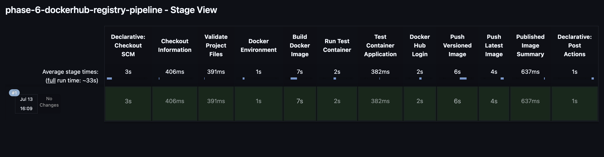

---

## 🐳 Published Docker Hub Tags

Docker Hub displayed both published tags:

```text
1
latest
```

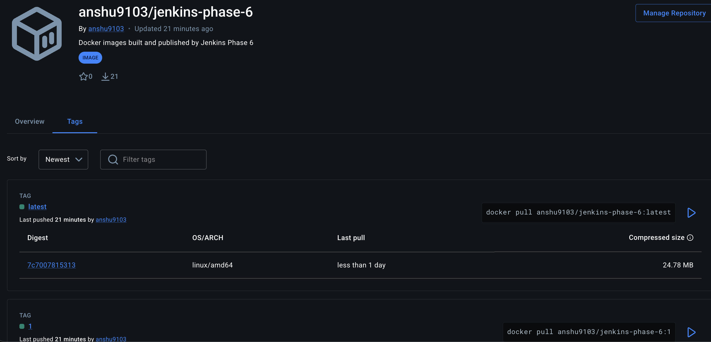

The versioned tag provides traceability to Jenkins Build `#1`, while `latest` provides a convenient current release tag.

---

## 🧹 Pipeline Cleanup

The final Console Output confirmed:

```text
Removing login credentials for https://index.docker.io/v1/
Phase 6 Pipeline cleanup completed.
Jenkins Phase 6 Docker Hub Pipeline completed successfully.
Finished: SUCCESS
```

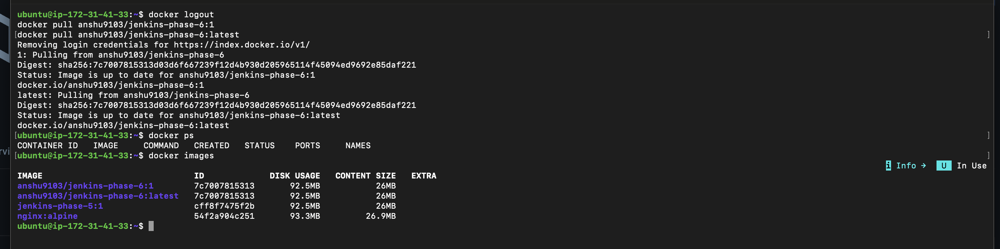

---

## 🌍 Published Application Verification

The published image was pulled:

```bash
docker pull anshu9103/jenkins-phase-6:latest
```

A temporary preview container was started:

```bash
docker run -d \
  --name jenkins-phase-6-preview \
  -p 8082:80 \
  anshu9103/jenkins-phase-6:latest
```

The application was opened using:

```text
http://JENKINS_PUBLIC_IP:8082
```

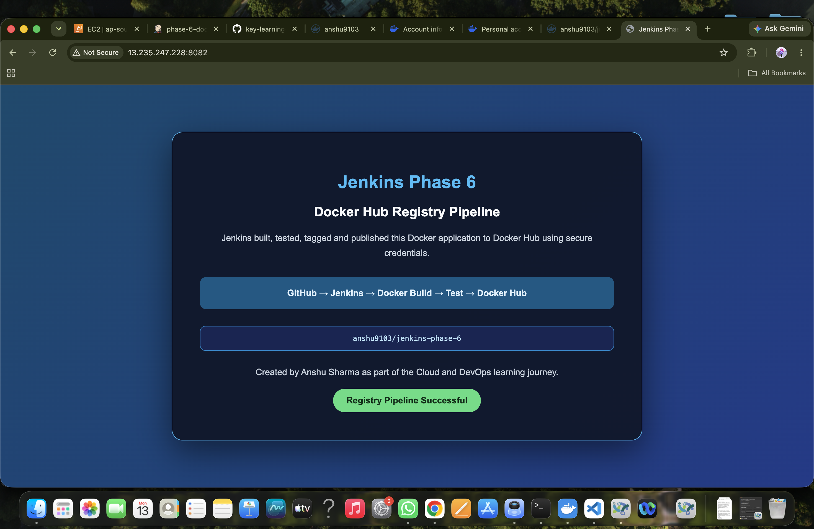

After verification:

```bash
docker rm -f jenkins-phase-6-preview
```

The temporary security-group rule for port `8082` was also removed.

---

## 📊 Final Results

| Component | Result |
|---|---|
| Docker Hub repository | ✅ Created |
| Personal access token | ✅ Created |
| Jenkins credential | ✅ Secured |
| Docker image build | ✅ Passed |
| Container test | ✅ Passed |
| Secure registry login | ✅ Passed |
| Version tag `1` | ✅ Published |
| Tag `latest` | ✅ Published |
| Published image verification | ✅ Passed |
| Temporary container cleanup | ✅ Completed |
| Docker logout | ✅ Completed |
| Final Pipeline | ✅ SUCCESS |

---

## 🔐 Security Practices

This phase followed these practices:

- Docker Hub password was not used.
- A dedicated personal access token was created.
- The token had only required read/write access.
- The token was stored in Jenkins Credentials.
- The Jenkinsfile referenced only the credential ID.
- `withCredentials` temporarily injected the values.
- Jenkins masked supported token patterns.
- `--password-stdin` avoided a command-line password.
- `set +x` prevented shell command tracing during login.
- `docker logout` removed temporary login credentials.
- No token appeared in GitHub or documentation.

---

## 🧠 What I Learned

In this phase, I learned:

- What a container registry is.
- How Docker Hub stores Docker images.
- Why access tokens are safer than account passwords.
- How Jenkins Credentials protect secrets.
- How `withCredentials` works.
- How Docker authenticates with `--password-stdin`.
- How to create versioned image tags.
- How to publish a `latest` tag.
- How Docker layers are reused during a push.
- How Docker image digests identify immutable content.
- How to test an image before publishing it.
- How to pull and verify an image after publication.
- How to log out and clean temporary resources.

---

## 🛠️ Troubleshooting

Warnings and diagnostic guidance are documented separately:

➡️ [View TROUBLESHOOTING.md](TROUBLESHOOTING.md)

---

## 💰 Cost and Cleanup

This phase reused the same Jenkins EC2 instance.

After practice:

- Temporary containers were removed.
- Docker Hub login credentials were removed.
- Temporary port `8082` was removed from the security group.
- The Jenkins EC2 instance is stopped instead of destroyed.
- Published Docker Hub images remain available.

Local images can be removed later if disk space becomes limited:

```bash
docker image rm anshu9103/jenkins-phase-6:1
docker image rm anshu9103/jenkins-phase-6:latest
```

---

## 🚀 Next Phase

### Phase 7 — Parameterized Deployment Pipeline

The next phase can introduce:

- Jenkins build parameters.
- Development and production environments.
- Environment selection.
- Version selection.
- Conditional stages.
- Manual production approval.
- Controlled Docker deployment.

---

## ✅ Conclusion

Jenkins Phase 6 successfully implemented a secure Docker registry publishing workflow.

Jenkins built and tested the application, securely authenticated with Docker Hub, published both versioned and latest image tags, displayed the image digest and cleaned all temporary authentication and container resources.

Final result:

```text
Finished: SUCCESS
```

---

<div align="center">

**Created by Anshu Sharma**

*Cloud and DevOps Learning Journey*

**Phase 6 Status: ✅ Completed**

</div>