<div align="center">

# 🚀 Jenkins Phase 7 — Parameterized Deployment Pipeline

**Deploying versioned Docker images to development and production environments through Jenkins parameters**

Part of the [Jenkins Learning Journey](../README.md)


</div>

---

## 📌 Project Overview

This phase extends the Jenkins Docker learning journey by deploying an existing Docker image to separate development and production environments.

Jenkins retrieves the Pipeline from GitHub and presents build parameters that allow the user to select:

```text
Deployment environment
Docker image tag
Container retention preference
```

The Pipeline pulls the selected image from Docker Hub, creates an environment-specific Docker container and validates the running application.

Development deployments run automatically, while production deployments pause and require manual approval.

The Docker image published during Phase 6 is reused:

```text
anshu9103/jenkins-phase-6:latest
anshu9103/jenkins-phase-6:1
```

Final results:

```text
Phase 7 development deployment completed successfully.
Phase 7 production deployment completed successfully.
Finished: SUCCESS
```

---

## 🎯 Objectives

The objectives of this phase were to:

- Create a parameterized Jenkins Pipeline.
- Use choice, string and boolean parameters.
- Select a deployment environment at build time.
- Select a Docker image tag at build time.
- Reuse the image published during Phase 6.
- Deploy development and production containers separately.
- Assign a unique container name to each environment.
- Assign a unique host port to each environment.
- Use conditional Pipeline stages.
- Skip production approval during development.
- Require manual approval before production deployment.
- Validate the deployed application automatically.
- Control whether a container remains running.
- Configure a Docker restart policy.
- Display a deployment summary.
- Clean temporary Pipeline resources.
- Understand basic deployment promotion controls.

---

## 🛠️ Technologies Used

| Technology | Purpose |
|---|---|
| Jenkins | Parameterized deployment orchestration |
| Docker | Application container deployment |
| Docker Hub | Source of the published application image |
| Nginx Alpine | Lightweight application web server |
| GitHub | Jenkinsfile and documentation repository |
| Git | Repository checkout and revision tracking |
| Jenkinsfile | Deployment Pipeline as Code |
| Groovy | Declarative Pipeline syntax |
| Jenkins Parameters | Environment and image selection |
| Jenkins Input | Manual production approval |
| Shell | Docker and validation commands |
| curl | HTTP deployment testing |
| AWS EC2 | Jenkins and Docker deployment host |
| AWS Security Group | Temporary browser access to ports `8083` and `8084` |

---

## 🏗️ Pipeline Architecture

```text
User
  ↓
Jenkins Build Parameters
  ↓
Select Environment and Image Tag
  ↓
GitHub Repository Checkout
  ↓
Parameter Validation
  ↓
Docker Hub Image Pull
  ↓
Environment Selection
  ├── Development
  │      ↓
  │   Automatic Deployment
  │      ↓
  │   Port 8083
  │
  └── Production
         ↓
      Manual Approval
         ↓
      Port 8084
  ↓
Container Application Test
  ↓
Deployment Summary
  ↓
Optional Container Retention
```

---

## 📁 Project Structure

```text
phase-7-parameterized-deployment/
├── Jenkinsfile
├── README.md
├── screenshots/
│   ├── 01-first-build-parameters-not-initialized.png
│   ├── 02-development-build-parameters.png
│   ├── 03-development-pipeline-success.png
│   ├── 04-development-container-running.png
│   ├── 05-development-application-preview.png
│   ├── 06-production-build-parameters.png
│   ├── 07-production-approval-required.png
│   ├── 08-production-pipeline-success.png
│   ├── 09-both-environment-containers-running.png
│   ├── 10-production-application-preview.png
│   ├── 11-deployment-console-success.png
│   └── 12-container-cleanup.png
└── TROUBLESHOOTING.md
```

Phase 7 does not contain another application directory or Dockerfile.

It deploys the tested image already published during Phase 6.

---

## ☁️ Jenkins Infrastructure

This phase reused the existing Jenkins controller running on an Ubuntu 24.04 AWS EC2 instance.

The same server contains:

- Jenkins
- Docker Engine
- Jenkins Pipeline jobs
- Docker images
- Build history
- Pipeline workspaces
- Development containers
- Production containers

The EC2 instance is stopped after practice instead of being destroyed.

> A production environment should normally use dedicated Jenkins agents and separate deployment servers instead of running deployments on the Jenkins controller.

---

## 🐳 Docker Hub Image

Phase 7 reused the Docker Hub repository created during Phase 6:

```text
anshu9103/jenkins-phase-6
```

Repository URL:

```text
https://hub.docker.com/r/anshu9103/jenkins-phase-6
```

Available tags used during this phase:

```text
latest
1
```

Complete image references:

```text
anshu9103/jenkins-phase-6:latest
anshu9103/jenkins-phase-6:1
```

No new image was built or published during Phase 7.

The purpose of this phase was to deploy a previously built and tested image.

---

## 🎛️ Pipeline Parameters

The Jenkinsfile defines three build parameters.

### Deployment Environment

```text
DEPLOY_ENV
```

Available choices:

```text
development
production
```

### Docker Image Tag

```text
IMAGE_TAG
```

Example values:

```text
latest
1
```

### Keep Container

```text
KEEP_CONTAINER
```

Behavior:

```text
true  → Keep the deployed container running
false → Remove the container after validation
```

The parameterized build page allows the same Jenkinsfile to perform multiple deployment operations without editing the Pipeline code.

---

## 🌍 Environment Configuration

| Environment | Container name | Host port | Container port | Approval |
|---|---|---:|---:|---|
| Development | `jenkins-phase-7-dev` | `8083` | `80` | Not required |
| Production | `jenkins-phase-7-prod` | `8084` | `80` | Required |

Development URL:

```text
http://JENKINS_PUBLIC_IP:8083
```

Production URL:

```text
http://JENKINS_PUBLIC_IP:8084
```

---

## ⚙️ Jenkins Job Configuration

The following Pipeline job was created:

```text
phase-7-parameterized-deployment
```

### SCM Configuration

| Setting | Value |
|---|---|
| Definition | Pipeline script from SCM |
| SCM | Git |
| Repository | `https://github.com/anshu-sharma-devops/key-learning-of-cloud-and-devops.git` |
| Credentials | None — public repository |
| Branch | `*/main` |
| Script Path | `02-jenkins/phase-7-parameterized-deployment/Jenkinsfile` |
| Lightweight Checkout | Enabled |

---

## 🧩 Pipeline Stages

### Checkout SCM

Retrieves the repository and Phase 7 Jenkinsfile from GitHub.

### Checkout Information

Displays the Git commit used for the deployment:

```bash
git log -1 --oneline
```

Example output:

```text
6fc2de0 Add Jenkins Phase 7 parameterized deployment pipeline
```

### Initialize Deployment

Reads the selected parameters and creates the environment configuration.

For development:

```text
Deployment environment: development
Docker image: anshu9103/jenkins-phase-6:latest
Container name: jenkins-phase-7-dev
Deployment port: 8083
Keep container: true
```

For production:

```text
Deployment environment: production
Docker image: anshu9103/jenkins-phase-6:1
Container name: jenkins-phase-7-prod
Deployment port: 8084
Keep container: true
```

### Validate Parameters

Confirms that:

- A deployment environment was selected.
- An image tag was provided.
- The image tag uses an accepted format.
- The selected environment is supported.

A missing or invalid value stops the Pipeline before Docker deployment begins.

### Pull Docker Image

Pulls the selected image from Docker Hub.

Development example:

```bash
docker pull anshu9103/jenkins-phase-6:latest
```

Production example:

```bash
docker pull anshu9103/jenkins-phase-6:1
```

### Production Approval

This stage runs only when:

```text
DEPLOY_ENV = production
```

Jenkins pauses the production Pipeline and displays a manual input action:

```text
Deploy to Production
```

Development builds skip this stage automatically.

Production deployment cannot continue until a user approves the request.

### Deploy Container

Jenkins removes an older container with the selected environment name and starts the new deployment.

Development deployment:

```text
jenkins-phase-7-dev
0.0.0.0:8083 → container port 80
```

Production deployment:

```text
jenkins-phase-7-prod
0.0.0.0:8084 → container port 80
```

The containers use:

```text
--restart unless-stopped
```

This allows the containers to restart after Docker or the EC2 instance restarts.

### Validate Deployment

Jenkins sends an HTTP request to the deployed application.

Development:

```bash
curl http://127.0.0.1:8083
```

Production:

```bash
curl http://127.0.0.1:8084
```

The response is checked for the Phase 6 application values:

```text
Jenkins Phase 6
Registry Pipeline Successful
```

Successful validation confirms that the selected image is running correctly.

### Deployment Summary

Displays:

- Selected environment
- Selected Docker image
- Container name
- Deployment port
- Running container information
- Application validation result

### Post Actions

The Pipeline reports whether the deployment:

```text
Succeeded
Failed
Was aborted
```

When `KEEP_CONTAINER` is enabled, Jenkins leaves the deployed container running.

When it is disabled, Jenkins removes the deployment container after validation.

Jenkins always removes the temporary HTTP response file:

```text
/tmp/phase-7-response.html
```

---

## ⚠️ First Parameterized Build

The first Pipeline execution failed during parameter validation.

Console Output:

```text
+ set -e
+ test -n
ERROR: script returned exit code 1
Finished: FAILURE
```

The remaining stages were skipped:

```text
Stage "Pull Docker Image" skipped due to earlier failure(s)
Stage "Production Approval" skipped due to earlier failure(s)
Stage "Deploy Container" skipped due to earlier failure(s)
Stage "Validate Deployment" skipped due to earlier failure(s)
```

This happened because Jenkins was registering the parameters from the Jenkinsfile for the first time.

After the initial run, Jenkins displayed:

```text
Build with Parameters
```

The next build was started with explicit values and completed successfully.

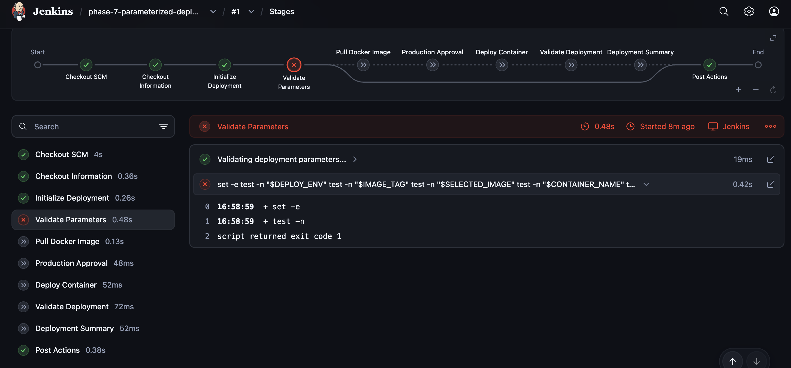

---

## 🟢 Development Deployment

The development build used:

```text
DEPLOY_ENV: development
IMAGE_TAG: latest
KEEP_CONTAINER: true
```

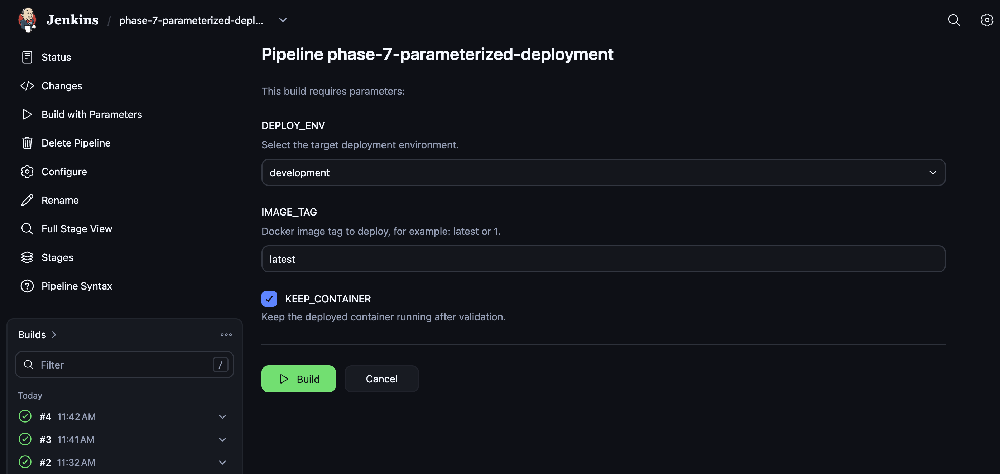

Jenkins selected:

```text
Docker image: anshu9103/jenkins-phase-6:latest
Container name: jenkins-phase-7-dev
Deployment port: 8083
```

The production approval stage was skipped because the selected environment was development.

The Pipeline completed successfully:

```text
Phase 7 development deployment completed successfully.
Deployment container will remain running.
Finished: SUCCESS
```

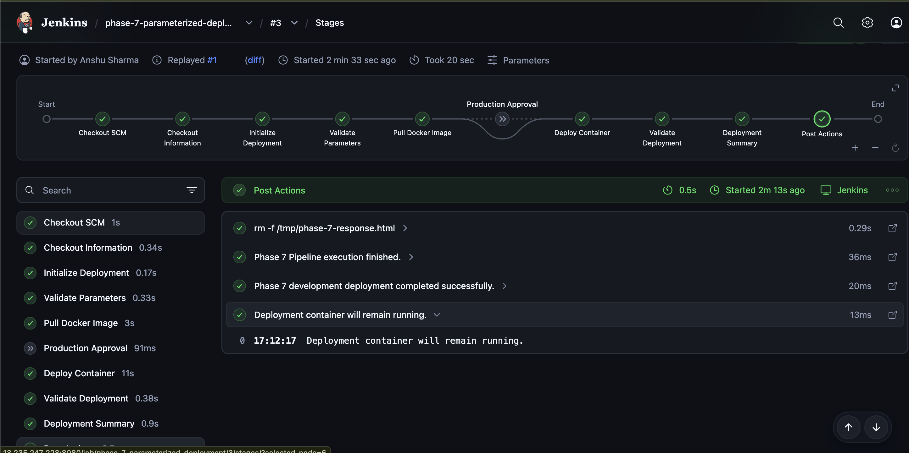

---

## 🐳 Development Container Verification

The development container was verified using:

```bash
docker ps --filter "name=jenkins-phase-7-dev"
```

Expected container:

```text
jenkins-phase-7-dev
```

Expected port mapping:

```text
0.0.0.0:8083 → container port 80
```

The application was tested locally:

```bash
curl -I http://127.0.0.1:8083
```

Expected response:

```text
HTTP/1.1 200 OK
```

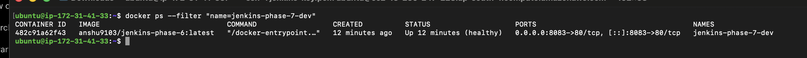

---

## 🌐 Development Application Verification

A temporary AWS security-group rule was added:

| Type | Port | Source |
|---|---:|---|
| Custom TCP | `8083` | My IP |

The development application was opened using:

```text
http://JENKINS_PUBLIC_IP:8083
```

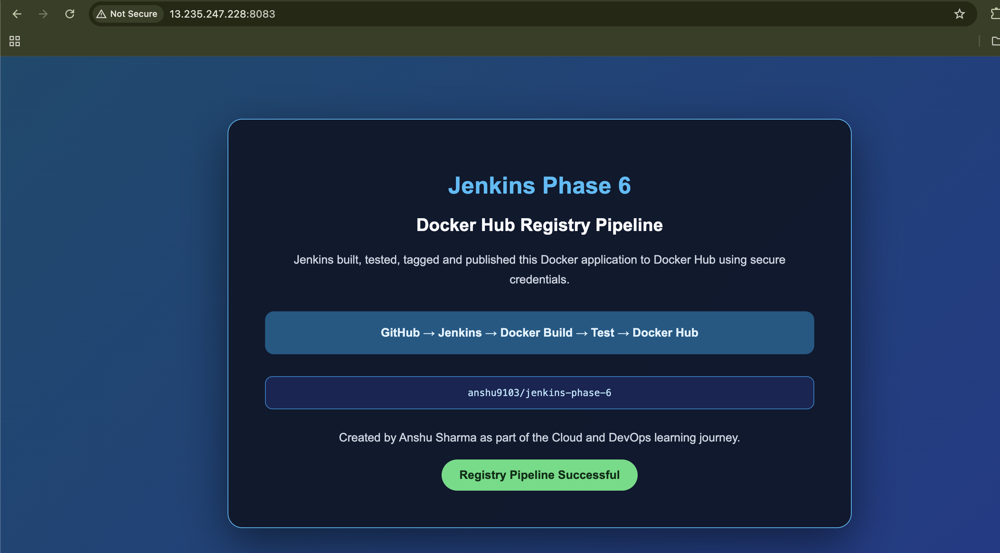

---

## 🔴 Production Deployment

The production build used:

```text
DEPLOY_ENV: production
IMAGE_TAG: 1
KEEP_CONTAINER: true
```

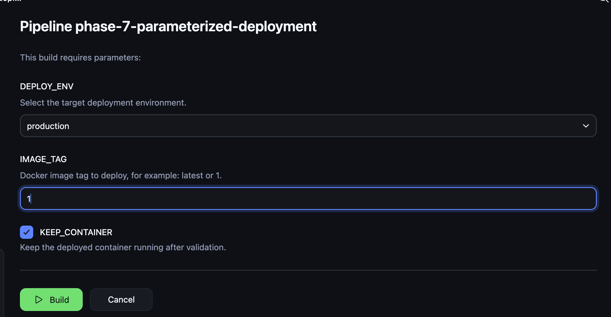

Jenkins selected:

```text
Docker image: anshu9103/jenkins-phase-6:1
Container name: jenkins-phase-7-prod
Deployment port: 8084
```

---

## ✋ Production Approval

Unlike development, the production deployment paused at:

```text
Production Approval
```

The Pipeline waited for a user to select:

```text
Deploy to Production
```

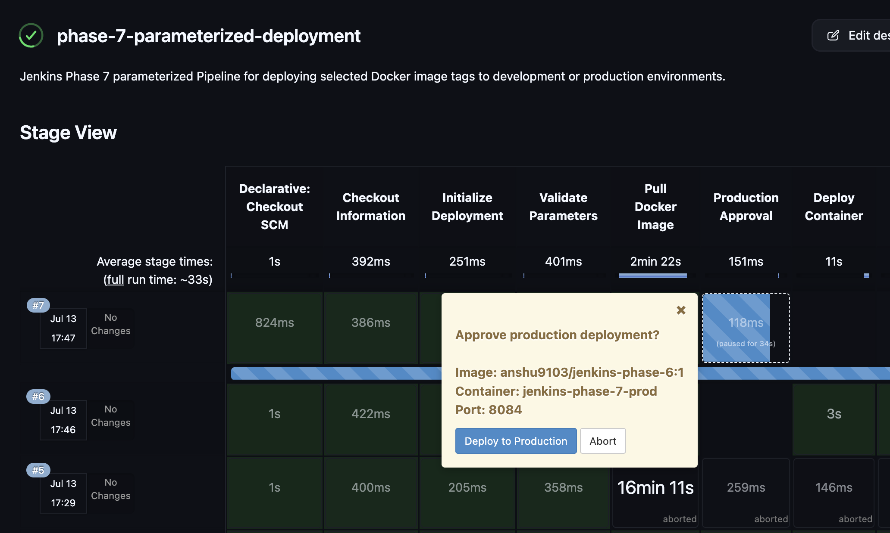

After approval, Jenkins continued with:

```text
Deploy Container
Validate Deployment
Deployment Summary
Post Actions
```

The completed Pipeline reported:

```text
Phase 7 production deployment completed successfully.
Deployment container will remain running.
Finished: SUCCESS
```

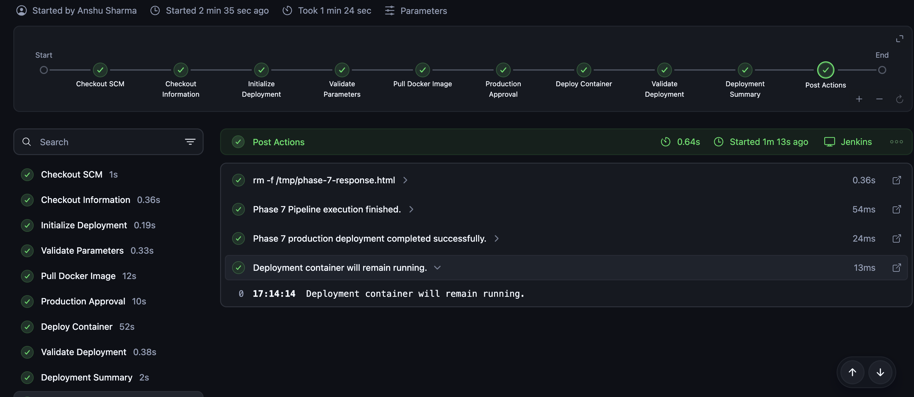

---

## 🐳 Environment Container Verification

Both environments were displayed using:

```bash
docker ps --filter "name=jenkins-phase-7"
```

Expected containers:

```text
jenkins-phase-7-dev
jenkins-phase-7-prod
```

Expected port mappings:

```text
jenkins-phase-7-dev  → 0.0.0.0:8083 → container port 80
jenkins-phase-7-prod → 0.0.0.0:8084 → container port 80
```

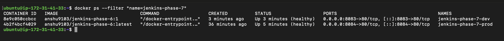

The applications were also tested locally:

```bash
curl -I http://127.0.0.1:8083
curl -I http://127.0.0.1:8084
```

Both environments returned a successful HTTP response.

---

## 🌐 Production Application Verification

A temporary AWS security-group rule was added:

| Type | Port | Source |
|---|---:|---|
| Custom TCP | `8084` | My IP |

The production application was opened using:

```text
http://JENKINS_PUBLIC_IP:8084
```

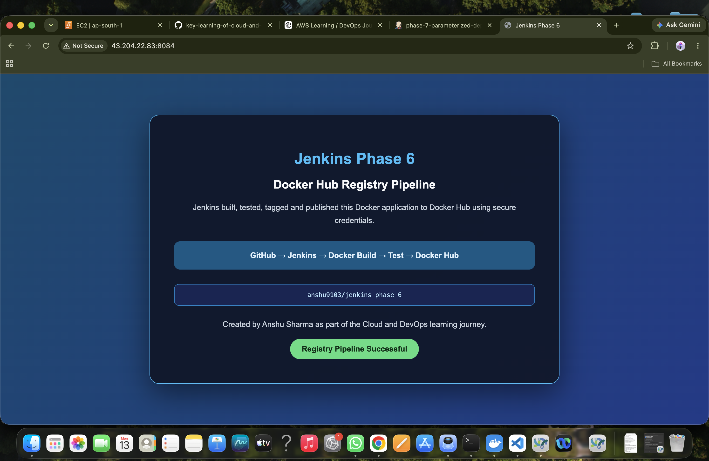

The rules for ports `8083` and `8084` were restricted to **My IP** and removed after testing.

---

## ✅ Complete Pipeline Execution

The production Pipeline completed the following stages:

```text
Checkout SCM
Checkout Information
Initialize Deployment
Validate Parameters
Pull Docker Image
Production Approval
Deploy Container
Validate Deployment
Deployment Summary
Post Actions
```

The Console Output confirmed successful validation and deployment:

```text
Phase 7 production deployment completed successfully.
Deployment container will remain running.
Phase 7 Pipeline execution finished.
Finished: SUCCESS
```

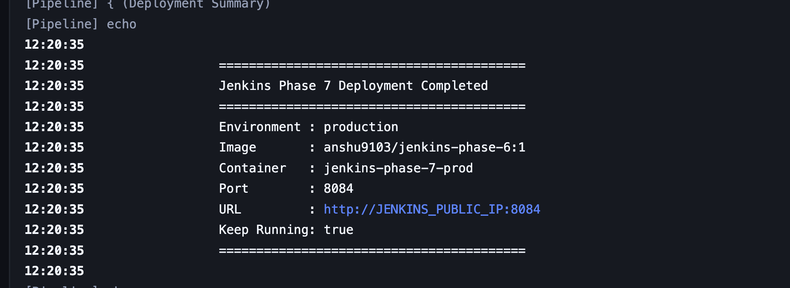

---

## 🔄 Container Restart Behavior

The deployment containers were created with:

```text
--restart unless-stopped
```

After the EC2 instance was stopped and started again, Docker restarted the containers automatically.

The services were checked using:

```bash
sudo systemctl is-active jenkins
sudo systemctl is-active docker
```

Expected output:

```text
active
active
```

The containers were checked using:

```bash
docker ps --filter "name=jenkins-phase-7"
```

This demonstrated how a Docker restart policy can preserve a deployment across server restarts.

---

## 🧹 Deployment Cleanup

After all screenshots and application tests were completed, both deployment containers were removed:

```bash
docker rm -f jenkins-phase-7-dev jenkins-phase-7-prod
```

Cleanup was verified using:

```bash
docker ps --filter "name=jenkins-phase-7"
```

The final command returned no matching running containers.

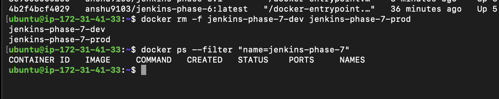

The temporary EC2 security-group rules for ports `8083` and `8084` were also removed.

---

## 📊 Final Results

| Component | Result |
|---|---|
| Parameterized Jenkins job | ✅ Created |
| Environment choice parameter | ✅ Configured |
| Image tag parameter | ✅ Configured |
| Container retention parameter | ✅ Configured |
| Phase 6 image reuse | ✅ Completed |
| Development deployment | ✅ Passed |
| Development validation | ✅ Passed |
| Production approval | ✅ Passed |
| Production deployment | ✅ Passed |
| Production validation | ✅ Passed |
| Separate environment ports | ✅ Configured |
| Docker restart policy | ✅ Verified |
| Temporary container cleanup | ✅ Completed |
| Temporary security-group cleanup | ✅ Completed |
| Final Pipeline | ✅ SUCCESS |

---

## 🔐 Deployment Practices

This phase followed these practices:

- The same tested image was reused across environments.
- No Docker Hub token was written in the Jenkinsfile.
- No credentials were added to GitHub.
- Development and production used separate container names.
- Development and production used separate ports.
- Production required explicit manual approval.
- Image versions could be selected at deployment time.
- Parameters were validated before deployment.
- The application was tested after deployment.
- Containers used a restart policy.
- Temporary browser ports were restricted to My IP.
- Temporary security-group rules were removed after testing.
- Deployment containers were removed after documentation was completed.

---

## 🧠 What I Learned

In this phase, I learned:

- What a parameterized Jenkins Pipeline is.
- How Jenkins choice parameters work.
- How Jenkins string parameters work.
- How Jenkins boolean parameters work.
- How to select an image version during deployment.
- How to reuse a tested Docker image.
- How to deploy the same image to multiple environments.
- How conditional Pipeline stages work.
- Why development and production should remain separate.
- How to add manual approval before production.
- How the Jenkins `input` step works.
- How to assign different Docker ports.
- How to validate a deployed application.
- How Docker restart policies work.
- Why the first parameterized build may initialize parameters.
- How to clean deployment containers safely.

---

## 🛠️ Troubleshooting

The first build parameter issue, EC2 restart behavior, browser access problems and Docker deployment diagnostics are documented separately:

➡️ [View TROUBLESHOOTING.md](TROUBLESHOOTING.md)

---

## 💰 Cost and Cleanup

This phase reused the same Jenkins EC2 instance.

After practice:

- Development and production containers were removed.
- Temporary response files were removed.
- Temporary ports `8083` and `8084` were removed from the security group.
- No new Docker image was created.
- The Phase 6 Docker Hub images remain available.
- The Jenkins EC2 instance is stopped instead of destroyed.

The Phase 6 images can remain on the server for later Pipeline practice.

To review them:

```bash
docker image ls anshu9103/jenkins-phase-6
```

---

## 🚀 Next Phase

### Phase 8 — Jenkins Credentials and Secure Deployment

The next phase can introduce:

- Secret text credentials.
- Secure environment variables.
- Credential masking.
- Protected deployment values.
- Credential scope.
- Secret-file handling.
- Secure Pipeline validation.
- Preventing secrets from entering GitHub.

---

## ✅ Conclusion

Jenkins Phase 7 successfully implemented a parameterized development and production deployment workflow.

Jenkins accepted environment and image parameters, pulled the selected image from Docker Hub, deployed separate containers, validated both applications and required manual approval before production.

Final deployment flow:

```text
Development → Automatic deployment → Port 8083
Production  → Manual approval      → Port 8084
```

Final result:

```text
Finished: SUCCESS
```

---

<div align="center">

**Created by Anshu Sharma**

*Cloud and DevOps Learning Journey*

**Phase 7 Status: ✅ Completed**

</div>